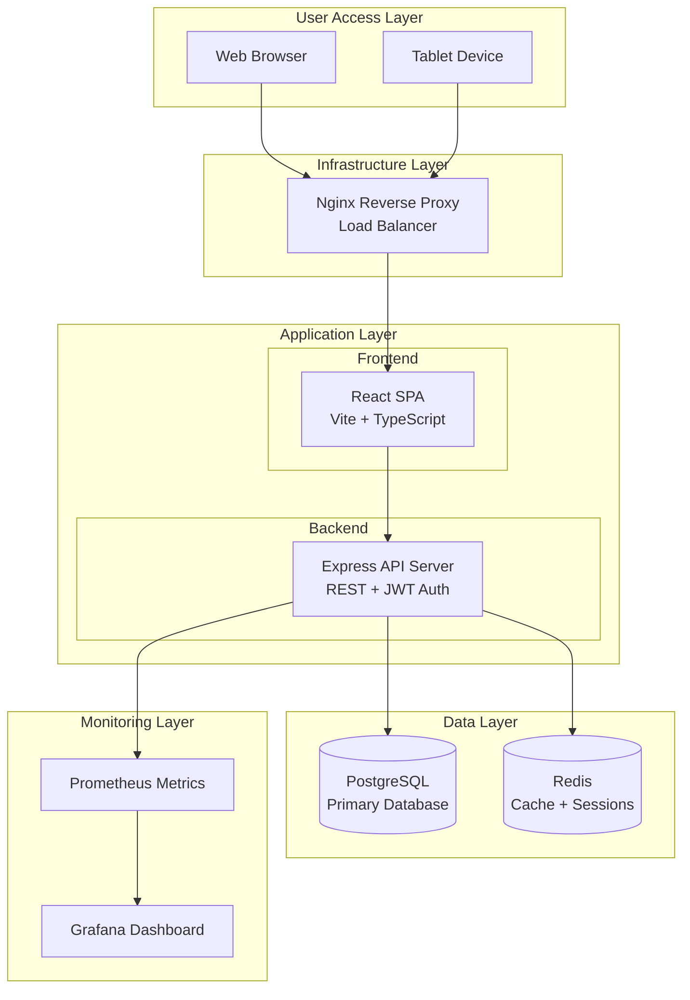
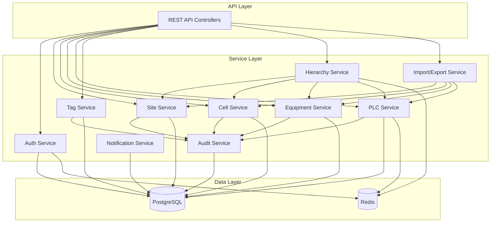
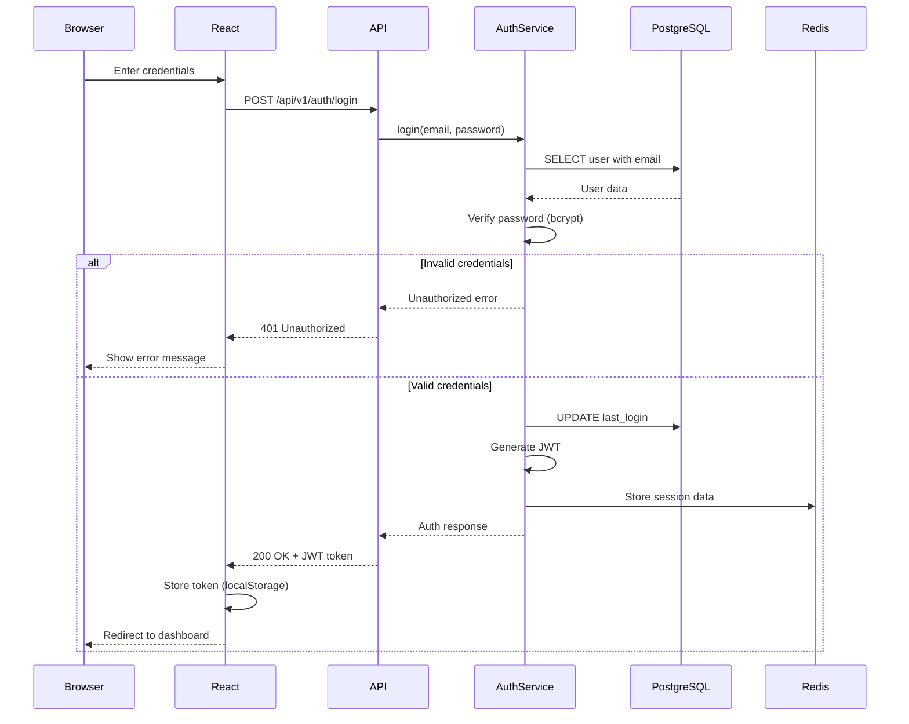
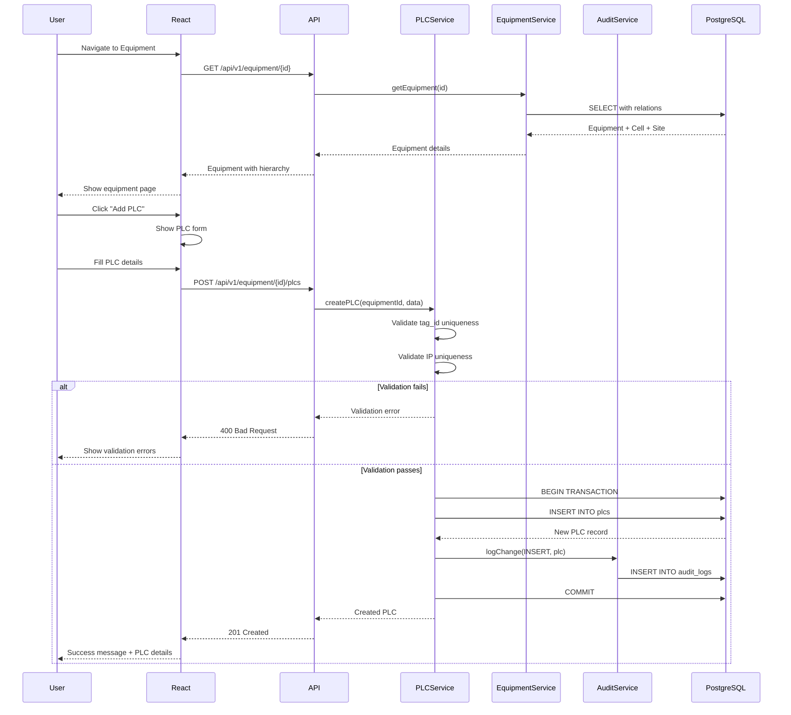
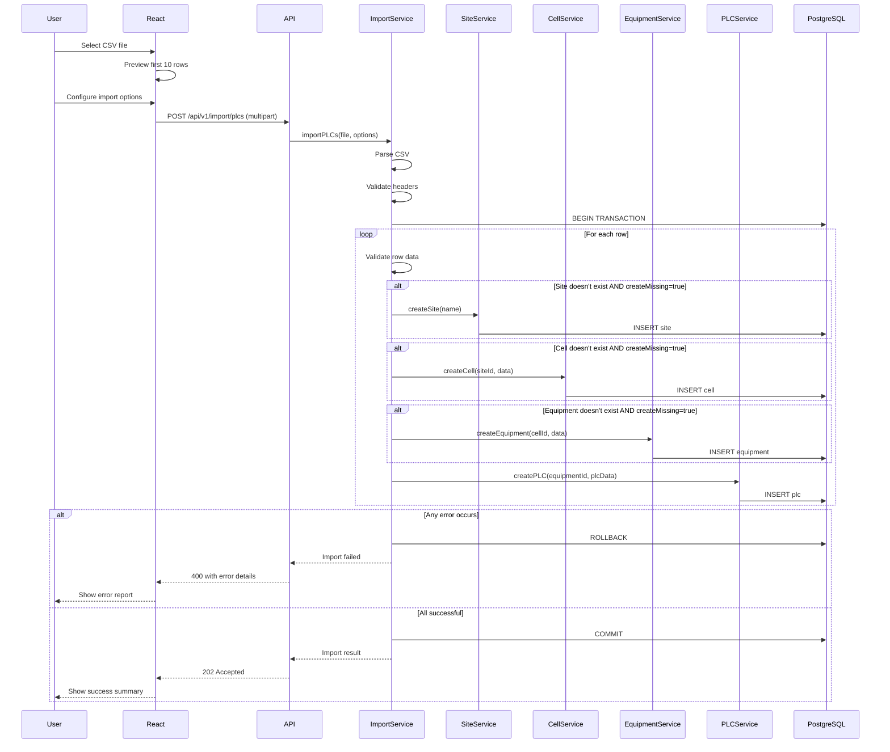
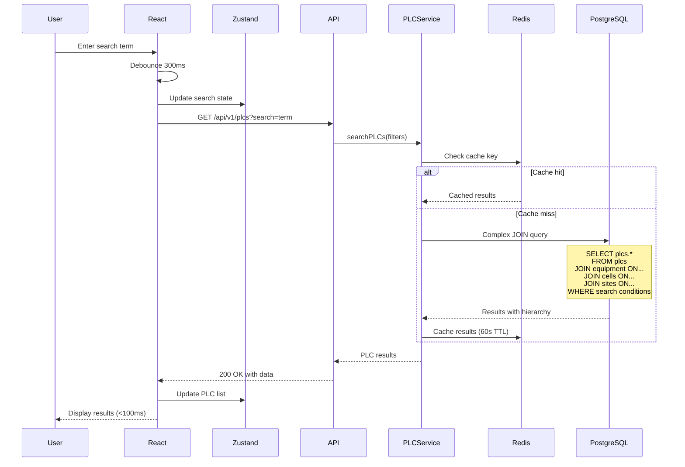
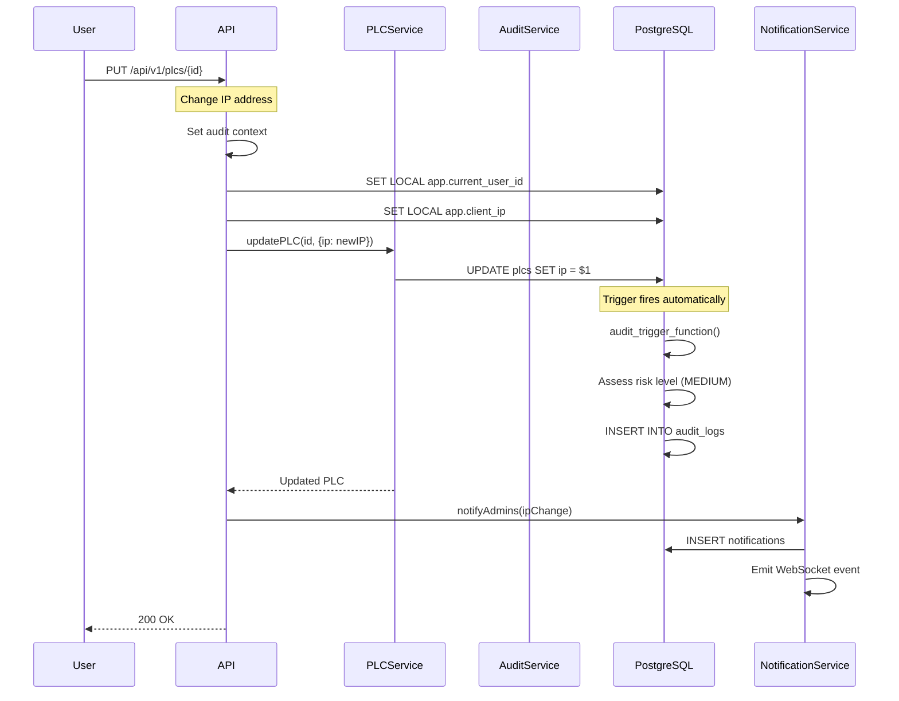
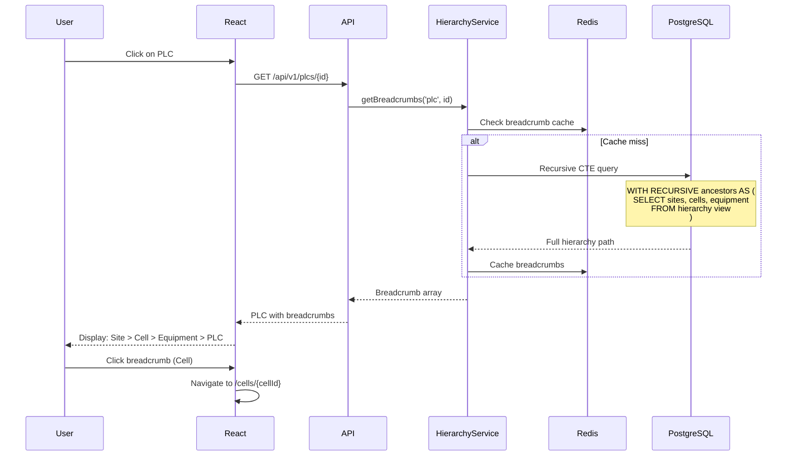
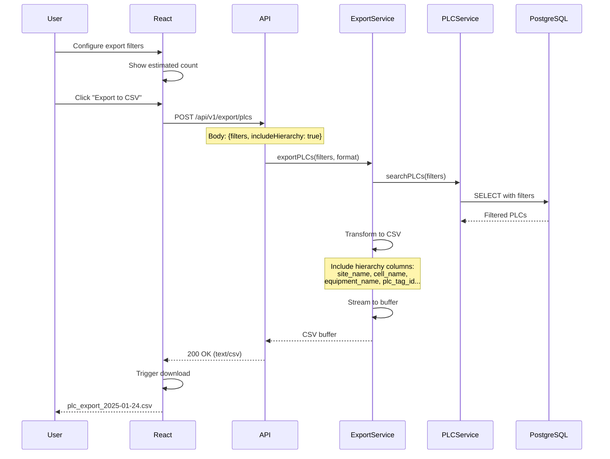

# Industrial Inventory Multi-App Framework Fullstack Architecture Document

This document outlines the complete fullstack architecture for Industrial Inventory Multi-App Framework, including backend
systems, frontend implementation, and their integration. It serves as the single source of truth for AI-driven
development, ensuring consistency across the entire technology stack.

This unified approach combines what would traditionally be separate backend and frontend architecture documents,
streamlining the development process for modern fullstack applications where these concerns are increasingly
intertwined.

## Starter Template or Existing Project
N/A - Greenfield project

## Change Log

| Date | Version | Description | Author |
|------|---------|-------------|--------|
| 2025-01-24 | 1.0 | Initial architecture document creation | Winston (Architect) |
| 2025-07-25 | 2.0 | Comprehensive technical architecture for Epic 0 implementation | Claude (Technical Architect) |

## High Level Architecture

### Technical Summary
The Industrial Inventory Multi-App Framework employs a layered monolithic architecture deployed via Docker Swarm
for on-premise industrial environments. Built with React + TypeScript frontend and Node.js + Express backend, the
system provides RESTful APIs for communication between layers. The architecture leverages PostgreSQL for persistent
storage and Redis for caching/sessions, with all services orchestrated through Docker Compose. This design achieves
the PRD goals of high performance (<100ms queries), ISO compliance through comprehensive audit logging, and provides
a reusable foundation for future industrial applications while maintaining compatibility with air-gapped networks.

### Platform and Infrastructure Choice
**Platform:** On-Premise Docker Swarm
**Key Services:** PostgreSQL 15, Redis 7, Nginx 1.24, Grafana 9.x, Prometheus 2.x
**Deployment Host and Regions:** Single on-premise data center (air-gapped industrial network)

### Repository Structure
**Structure:** Monorepo with clear module boundaries
**Monorepo Tool:** pnpm workspaces (better performance and disk efficiency than npm/yarn)
**Package Organization:**
- `/apps` - Application packages (web, api)
- `/packages` - Shared libraries (ui, shared-types, config)
- `/infrastructure` - Docker configs and deployment scripts

### High Level Architecture Diagram



### Architectural Patterns
- **Layered Architecture:** Clear separation between presentation, business logic, and data layers - *Rationale:* Simplifies development and maintenance for solo developer while enabling future team scaling
- **Component-Based UI:** Reusable React components with TypeScript and Storybook documentation - *Rationale:* Accelerates development of future apps within the framework
- **Repository Pattern:** Abstract data access through TypeORM repositories - *Rationale:* Enables testing and potential future database migrations
- **API Gateway Pattern:** Nginx as single entry point for all requests - *Rationale:* Centralized SSL termination, load balancing, and request routing
- **JWT Authentication:** Stateless auth with Redis session storage - *Rationale:* Scalable authentication that works in distributed environments
- **Audit Trail Pattern:** Comprehensive logging of all data modifications - *Rationale:* ISO compliance requirement with PostgreSQL triggers for reliability
- **Offline-First Design:** Local caching and sync mechanisms - *Rationale:* Critical for air-gapped industrial environments
- **Schema-Per-App Pattern:** Shared core + app-specific schemas - *Rationale:* Enables multi-app framework while maintaining data isolation

## Tech Stack

This is the DEFINITIVE technology selection for the entire project. All development must use these exact versions.

### Technology Stack Table

| Category | Technology | Version | Purpose | Rationale |
|----------|------------|---------|---------|-----------|
| Frontend Language | TypeScript | 5.8.3 | Type-safe frontend development | Latest stable, catches errors early, improves maintainability |
| Frontend Framework | React | 19.1.0 | UI component framework | Latest with server components, improved performance |
| UI Component Library | Material-UI (MUI) | 7.0.0 | Pre-built industrial UI components | CSS layers support, better Tailwind integration |
| State Management | Zustand | 5.0.2 | Client state management | Latest stable, TypeScript-first, simple API |
| Backend Language | TypeScript | 5.8.3 | Type-safe backend development | Code sharing with frontend, consistent DX |
| Backend Framework | Express | 5.1.0 | HTTP server framework | Latest LTS, improved security, Node 18+ support |
| API Style | REST | OpenAPI 3.1 | API communication protocol | Latest spec, better JSON Schema support |
| Database | PostgreSQL | 17.5 | Primary data storage | Latest with major performance improvements |
| Cache | Redis | 8.0 | Session store and caching | New data structures, 2x performance boost |
| File Storage | Local Filesystem | N/A | Equipment documentation storage | Simplicity for air-gapped environments |
| Authentication | JWT + bcrypt | jsonwebtoken 10.0 | User authentication | Latest stable, improved security |
| Frontend Testing | Jest + RTL | 30.0 / 16.1 | Component and unit testing | Latest with ESM support |
| Backend Testing | Jest + Supertest | 30.0 / 7.0 | API and unit testing | Consistent with frontend testing |
| E2E Testing | Playwright | 1.50 | End-to-end testing | Latest with improved debugging |
| Build Tool | Vite | 6.0 | Frontend bundling | Latest with Rolldown support |
| Bundler | Rolldown (via Vite) | 0.15 | JavaScript bundling | Rust-based, faster than esbuild |
| IaC Tool | Docker Compose | 2.32 | Infrastructure as code | Latest with improved performance |
| CI/CD | GitHub Actions | N/A | Automation pipeline | Continuously updated by GitHub |
| Monitoring | Prometheus | 3.0 | Metrics collection | Latest with native histograms |
| Logging | Winston | 3.17 | Application logging | Latest stable version |
| CSS Framework | Emotion (via MUI) | 12.0 | CSS-in-JS styling | Latest with MUI v7 support |

## Data Models

### User
**Purpose:** Core authentication and authorization entity for all framework applications

**Key Attributes:**
- id: UUID - Unique identifier using gen_random_uuid()
- email: string - Unique email for authentication
- password_hash: string - bcrypt hashed password
- first_name: string - User's first name
- last_name: string - User's last name
- role_id: UUID - Foreign key to roles table
- is_active: boolean - Account status flag
- last_login: timestamp - Track user activity
- created_at: timestamp - Account creation time
- updated_at: timestamp - Last modification time

#### User TypeScript Interface

```typescript
interface User {
  id: string;
  email: string;
  firstName: string;
  lastName: string;
  roleId: string;
  isActive: boolean;
  lastLogin: Date | null;
  createdAt: Date;
  updatedAt: Date;
}
```

#### User Relationships
- Has one Role (many-to-one with roles table)
- Has many AuditLogs (one-to-many with audit_logs)
- Has many Notifications (one-to-many with notifications)

### Site
**Purpose:** Top-level organizational unit representing physical locations

**Key Attributes:**
- id: UUID - Unique identifier using gen_random_uuid()
- name: string - Site name (e.g., "Plant-A", "Facility-North")
- created_at: timestamp - Creation time
- updated_at: timestamp - Last modification
- created_by: UUID - User who created record
- updated_by: UUID - Last user to modify

#### Site TypeScript Interface

```typescript
interface Site {
  id: string;
  name: string;
  createdAt: Date;
  updatedAt: Date;
  createdBy: string;
  updatedBy: string;
}
```

#### Site Relationships
- Has many Cells (one-to-many with cells)
- Created/Updated by User (many-to-one with users)

### Cell
**Purpose:** Production cells or areas within a site

**Key Attributes:**
- id: UUID - Unique identifier
- site_id: UUID - Foreign key to sites table
- name: string - Cell name (e.g., "Assembly-Line-1")
- line_number: string - Production line identifier
- created_at: timestamp - Creation time
- updated_at: timestamp - Last modification
- created_by: UUID - User who created record
- updated_by: UUID - Last user to modify

#### Cell TypeScript Interface

```typescript
interface Cell {
  id: string;
  siteId: string;
  name: string;
  lineNumber: string;
  createdAt: Date;
  updatedAt: Date;
  createdBy: string;
  updatedBy: string;
}
```

#### Cell Relationships
- Belongs to Site (many-to-one with sites)
- Has many Equipment (one-to-many with equipment)
- Created/Updated by User (many-to-one with users)

### Equipment
**Purpose:** Physical equipment units within a cell

**Key Attributes:**
- id: UUID - Unique identifier
- cell_id: UUID - Foreign key to cells table
- name: string - Equipment name/identifier
- equipment_type: string - Category (PRESS, ROBOT, OVEN, CONVEYOR, ASSEMBLY_TABLE, OTHER)
- created_at: timestamp - Creation time
- updated_at: timestamp - Last modification
- created_by: UUID - User who created record
- updated_by: UUID - Last user to modify

#### Equipment TypeScript Interface

```typescript
interface Equipment {
  id: string;
  cellId: string;
  name: string;
  equipmentType: EquipmentType;
  createdAt: Date;
  updatedAt: Date;
  createdBy: string;
  updatedBy: string;
}

enum EquipmentType {
  PRESS = 'PRESS',
  ROBOT = 'ROBOT',
  OVEN = 'OVEN',
  CONVEYOR = 'CONVEYOR',
  ASSEMBLY_TABLE = 'ASSEMBLY_TABLE',
  OTHER = 'OTHER'
}
```

#### Equipment Relationships
- Belongs to Cell (many-to-one with cells)
- Has many PLCs (one-to-many with plcs)
- Created/Updated by User (many-to-one with users)

### PLC
**Purpose:** Programmable Logic Controllers and industrial control devices

**Key Attributes:**
- id: UUID - Unique identifier
- equipment_id: UUID - Foreign key to equipment table
- tag_id: string - Unique PLC identifier/tag
- description: string - Human-readable description
- make: string - Manufacturer (Allen-Bradley, Siemens, etc.)
- model: string - Model number
- ip_address: string | null - Network address (unique when present)
- firmware_version: string | null - Current firmware
- created_at: timestamp - Creation time
- updated_at: timestamp - Last modification
- created_by: UUID - User who created record
- updated_by: UUID - Last user to modify

#### PLC TypeScript Interface

```typescript
interface PLC {
  id: string;
  equipmentId: string;
  tagId: string;
  description: string;
  make: string;
  model: string;
  ipAddress: string | null;
  firmwareVersion: string | null;
  createdAt: Date;
  updatedAt: Date;
  createdBy: string;
  updatedBy: string;
}
```

#### PLC Relationships
- Belongs to Equipment (many-to-one with equipment)
- Has many Tags (one-to-many with tags)
- Created/Updated by User (many-to-one with users)

### Tag
**Purpose:** Data points and I/O tags associated with PLCs

**Key Attributes:**
- id: UUID - Unique identifier
- plc_id: UUID - Foreign key to plcs table
- name: string - Tag name (e.g., "START_BUTTON", "TEMP_SENSOR_1")
- data_type: string - Data type (BOOL, INT, REAL, STRING)
- description: string | null - Tag purpose/description
- address: string | null - Memory address or I/O point
- created_at: timestamp - Creation time
- updated_at: timestamp - Last modification
- created_by: UUID - User who created record
- updated_by: UUID - Last user to modify

#### Tag TypeScript Interface

```typescript
interface Tag {
  id: string;
  plcId: string;
  name: string;
  dataType: TagDataType;
  description: string | null;
  address: string | null;
  createdAt: Date;
  updatedAt: Date;
  createdBy: string;
  updatedBy: string;
}

enum TagDataType {
  BOOL = 'BOOL',
  INT = 'INT',
  DINT = 'DINT',
  REAL = 'REAL',
  STRING = 'STRING',
  TIMER = 'TIMER',
  COUNTER = 'COUNTER'
}
```

#### Tag Relationships
- Belongs to PLC (many-to-one with plcs)
- Created/Updated by User (many-to-one with users)

### AuditLog
**Purpose:** ISO compliance tracking for all data modifications across the framework

**Key Attributes:**
- id: UUID - Unique identifier
- table_name: string - Table where change occurred
- record_id: UUID - ID of modified record
- action: string - INSERT, UPDATE, DELETE
- old_values: JSONB - Previous state (for updates)
- new_values: JSONB - New state
- user_id: UUID - User who made the change
- timestamp: timestamp - When change occurred
- ip_address: string - Client IP for security
- user_agent: string - Client information

#### AuditLog TypeScript Interface

```typescript
interface AuditLog {
  id: string;
  tableName: string;
  recordId: string;
  action: AuditAction;
  oldValues: Record<string, any> | null;
  newValues: Record<string, any> | null;
  userId: string;
  timestamp: Date;
  ipAddress: string;
  userAgent: string;
}

enum AuditAction {
  INSERT = 'INSERT',
  UPDATE = 'UPDATE',
  DELETE = 'DELETE'
}
```

#### AuditLog Relationships
- Belongs to User (many-to-one with users)
- Polymorphic relationship to any audited table via table_name/record_id

### Role
**Purpose:** Define permission sets for RBAC across all framework applications

**Key Attributes:**
- id: UUID - Unique identifier
- name: string - Role name (Admin, Engineer, Viewer)
- permissions: JSONB - Permission configuration
- description: string - Role purpose
- is_system: boolean - Protected system role flag
- created_at: timestamp - Creation time
- updated_at: timestamp - Last modification

#### Role TypeScript Interface

```typescript
interface Role {
  id: string;
  name: string;
  permissions: RolePermissions;
  description: string;
  isSystem: boolean;
  createdAt: Date;
  updatedAt: Date;
}

interface RolePermissions {
  equipment: {
    create: boolean;
    read: boolean;
    update: boolean;
    delete: boolean;
    export: boolean;
  };
  users: {
    create: boolean;
    read: boolean;
    update: boolean;
    delete: boolean;
  };
  audit: {
    read: boolean;
    export: boolean;
  };
}
```

#### Role Relationships
- Has many Users (one-to-many with users)

## API Specification

### REST API Specification

```yaml
openapi: 3.1.0
info:
  title: Industrial Inventory Multi-App Framework API
  version: 1.0.0
  description: RESTful API for industrial equipment inventory management with hierarchical organization
servers:
  - url: http://localhost:3000/api/v1
    description: Development server
  - url: https://inventory.local/api/v1
    description: Production server (on-premise)

paths:
  # Site Management
  /sites:
    get:
      tags: [Sites]
      summary: List all sites
      parameters:
        - $ref: '#/components/parameters/PageParam'
        - $ref: '#/components/parameters/PageSizeParam'
        - name: search
          in: query
          schema:
            type: string
      responses:
        200:
          description: Site list
          content:
            application/json:
              schema:
                $ref: '#/components/schemas/PaginatedSites'
                
    post:
      tags: [Sites]
      summary: Create new site
      requestBody:
        required: true
        content:
          application/json:
            schema:
              $ref: '#/components/schemas/SiteInput'
      responses:
        201:
          description: Site created
          
  /sites/{siteId}:
    parameters:
      - $ref: '#/components/parameters/SiteIdParam'
    get:
      tags: [Sites]
      summary: Get site details
      responses:
        200:
          description: Site details with cell count
          
  # Cell Management
  /sites/{siteId}/cells:
    parameters:
      - $ref: '#/components/parameters/SiteIdParam'
    get:
      tags: [Cells]
      summary: List cells in a site
      responses:
        200:
          description: Cell list
          
    post:
      tags: [Cells]
      summary: Create new cell in site
      requestBody:
        required: true
        content:
          application/json:
            schema:
              $ref: '#/components/schemas/CellInput'
              
  /cells/{cellId}:
    parameters:
      - $ref: '#/components/parameters/CellIdParam'
    get:
      tags: [Cells]
      summary: Get cell details
      responses:
        200:
          description: Cell details with equipment count
          
  # Equipment Management
  /cells/{cellId}/equipment:
    parameters:
      - $ref: '#/components/parameters/CellIdParam'
    get:
      tags: [Equipment]
      summary: List equipment in a cell
      responses:
        200:
          description: Equipment list
          
    post:
      tags: [Equipment]
      summary: Create new equipment in cell
      
  /equipment/{equipmentId}:
    parameters:
      - $ref: '#/components/parameters/EquipmentIdParam'
    get:
      tags: [Equipment]
      summary: Get equipment details
      
  # PLC Management
  /equipment/{equipmentId}/plcs:
    parameters:
      - $ref: '#/components/parameters/EquipmentIdParam'
    get:
      tags: [PLCs]
      summary: List PLCs in equipment
      
    post:
      tags: [PLCs]
      summary: Create new PLC
      
  /plcs:
    get:
      tags: [PLCs]
      summary: Search all PLCs with filtering
      parameters:
        - name: search
          in: query
          schema:
            type: string
          description: Search in tag_id, description, make, model
        - name: siteId
          in: query
          schema:
            type: string
            format: uuid
        - name: cellId
          in: query
          schema:
            type: string
            format: uuid
        - name: make
          in: query
          schema:
            type: string
        - name: model
          in: query
          schema:
            type: string
        - name: hasIpAddress
          in: query
          schema:
            type: boolean
      responses:
        200:
          description: PLC search results with full hierarchy
          content:
            application/json:
              schema:
                type: object
                properties:
                  data:
                    type: array
                    items:
                      $ref: '#/components/schemas/PLCWithHierarchy'
                      
  /plcs/{plcId}:
    parameters:
      - $ref: '#/components/parameters/PLCIdParam'
    get:
      tags: [PLCs]
      summary: Get PLC details with full hierarchy
      
  # Tag Management
  /plcs/{plcId}/tags:
    parameters:
      - $ref: '#/components/parameters/PLCIdParam'
    get:
      tags: [Tags]
      summary: List tags for a PLC
      
    post:
      tags: [Tags]
      summary: Create new tag
      
  # Bulk Operations
  /import/plcs:
    post:
      tags: [Import/Export]
      summary: Bulk import PLCs with hierarchy
      description: CSV must include site_name, cell_name, equipment_name
      requestBody:
        required: true
        content:
          multipart/form-data:
            schema:
              type: object
              properties:
                file:
                  type: string
                  format: binary
                createMissing:
                  type: boolean
                  description: Auto-create sites/cells/equipment if not found
                  
  /export/plcs:
    post:
      tags: [Import/Export]
      summary: Export PLCs to CSV with full hierarchy
      requestBody:
        content:
          application/json:
            schema:
              type: object
              properties:
                filters:
                  $ref: '#/components/schemas/PLCFilters'
                includeHierarchy:
                  type: boolean
                  default: true
                includeTags:
                  type: boolean
                  default: false
                  
  # Hierarchy Operations
  /hierarchy/tree:
    get:
      tags: [Hierarchy]
      summary: Get complete hierarchy tree
      responses:
        200:
          description: Hierarchical tree structure
          content:
            application/json:
              schema:
                type: array
                items:
                  type: object
                  properties:
                    id:
                      type: string
                    name:
                      type: string
                    type:
                      type: string
                      enum: [site, cell, equipment, plc]
                    children:
                      type: array
                      items:
                        type: object
                        
  /hierarchy/move:
    post:
      tags: [Hierarchy]
      summary: Move equipment between cells
      requestBody:
        required: true
        content:
          application/json:
            schema:
              type: object
              properties:
                equipmentId:
                  type: string
                  format: uuid
                targetCellId:
                  type: string
                  format: uuid
                  
components:
  schemas:
    PLCWithHierarchy:
      allOf:
        - $ref: '#/components/schemas/PLC'
        - type: object
          properties:
            hierarchy:
              type: object
              properties:
                site:
                  $ref: '#/components/schemas/Site'
                cell:
                  $ref: '#/components/schemas/Cell'
                equipment:
                  $ref: '#/components/schemas/Equipment'
```

## Components

### Auth Service
**Responsibility:** Handle all authentication and authorization logic including JWT token management, password hashing, role validation, and session management

**Key Interfaces:**
- `login(email: string, password: string): Promise<AuthResponse>`
- `validateToken(token: string): Promise<User>`
- `refreshToken(token: string): Promise<string>`
- `logout(userId: string): Promise<void>`

**Dependencies:** PostgreSQL (users, roles tables), Redis (session storage), bcrypt, jsonwebtoken

**Technology Stack:** TypeScript, Express middleware, JWT tokens with 24-hour expiry, Redis for token blacklisting

### Site Management Service
**Responsibility:** CRUD operations for sites, validation of site names, cascade handling for site deletion

**Key Interfaces:**
- `createSite(data: SiteInput): Promise<Site>`
- `getSites(filters: SiteFilters): Promise<PaginatedResponse<Site>>`
- `updateSite(id: string, data: SiteUpdate): Promise<Site>`
- `deleteSite(id: string): Promise<void>`

**Dependencies:** PostgreSQL (sites table), Audit Service

**Technology Stack:** TypeScript, TypeORM repositories, Joi validation

### Cell Management Service
**Responsibility:** Manage production cells within sites, enforce site-cell relationships, handle cell-to-equipment cascade operations

**Key Interfaces:**
- `createCell(siteId: string, data: CellInput): Promise<Cell>`
- `getCellsBySite(siteId: string): Promise<Cell[]>`
- `moveCell(cellId: string, newSiteId: string): Promise<Cell>`
- `getCellWithCounts(cellId: string): Promise<CellDetails>`

**Dependencies:** PostgreSQL (cells table), Site Service, Audit Service

**Technology Stack:** TypeScript, TypeORM with relations, transaction support

### Equipment Service
**Responsibility:** Equipment lifecycle management, type validation, equipment-to-PLC relationship management

**Key Interfaces:**
- `createEquipment(cellId: string, data: EquipmentInput): Promise<Equipment>`
- `getEquipmentByCell(cellId: string): Promise<Equipment[]>`
- `moveEquipment(equipmentId: string, newCellId: string): Promise<Equipment>`
- `getEquipmentWithPLCCount(equipmentId: string): Promise<EquipmentDetails>`

**Dependencies:** PostgreSQL (equipment table), Cell Service, Audit Service

**Technology Stack:** TypeScript, TypeORM, enum validation for equipment types

### PLC Service
**Responsibility:** Core PLC management including IP address uniqueness, tag ID validation, firmware tracking, search functionality

**Key Interfaces:**
- `createPLC(equipmentId: string, data: PLCInput): Promise<PLC>`
- `searchPLCs(filters: PLCSearchFilters): Promise<PLCWithHierarchy[]>`
- `updatePLCFirmware(plcId: string, version: string): Promise<PLC>`
- `findByIPAddress(ip: string): Promise<PLC | null>`

**Dependencies:** PostgreSQL (plcs table), Equipment Service, Audit Service, Redis (search cache)

**Technology Stack:** TypeScript, PostgreSQL full-text search, Redis caching for frequent queries

### Tag Service
**Responsibility:** PLC tag management, data type validation, address conflict detection

**Key Interfaces:**
- `createTag(plcId: string, data: TagInput): Promise<Tag>`
- `getTagsByPLC(plcId: string): Promise<Tag[]>`
- `bulkCreateTags(plcId: string, tags: TagInput[]): Promise<Tag[]>`
- `validateTagAddress(plcId: string, address: string): Promise<boolean>`

**Dependencies:** PostgreSQL (tags table), PLC Service, Audit Service

**Technology Stack:** TypeScript, batch operations for performance, enum validation for data types

### Hierarchy Service
**Responsibility:** Complex hierarchy queries, tree generation, breadcrumb creation, move operations across levels

**Key Interfaces:**
- `getFullHierarchy(): Promise<HierarchyNode[]>`
- `getBreadcrumbs(entityType: string, entityId: string): Promise<Breadcrumb[]>`
- `getAncestors(plcId: string): Promise<HierarchyPath>`
- `validateMove(sourceId: string, targetId: string): Promise<boolean>`

**Dependencies:** All entity services, PostgreSQL recursive CTEs

**Technology Stack:** TypeScript, PostgreSQL recursive queries, Redis caching for tree structure

### Import/Export Service
**Responsibility:** Bulk data operations, CSV parsing/generation, hierarchy validation during import, auto-creation of missing entities

**Key Interfaces:**
- `importPLCs(file: Buffer, options: ImportOptions): Promise<ImportResult>`
- `exportPLCs(filters: PLCFilters, format: ExportFormat): Promise<Buffer>`
- `validateCSV(file: Buffer): Promise<ValidationResult>`
- `generateTemplate(): Promise<Buffer>`

**Dependencies:** All entity services, csv-parse, csv-stringify libraries

**Technology Stack:** TypeScript, streaming for large files, transaction support for atomic imports

### Audit Service
**Responsibility:** Comprehensive audit logging, risk assessment, compliance reporting, audit log integrity

**Key Interfaces:**
- `logChange(change: AuditEntry): Promise<void>`
- `getAuditTrail(entityId: string): Promise<AuditLog[]>`
- `generateComplianceReport(dateRange: DateRange): Promise<Report>`
- `calculateRiskLevel(change: AuditEntry): RiskLevel`

**Dependencies:** PostgreSQL (audit_logs table), User Service

**Technology Stack:** TypeScript, PostgreSQL triggers, scheduled checksums for integrity

### Notification Service
**Responsibility:** In-app notifications, system alerts, batch notification processing

**Key Interfaces:**
- `createNotification(userId: string, notification: NotificationInput): Promise<void>`
- `getUserNotifications(userId: string): Promise<Notification[]>`
- `markAsRead(notificationId: string): Promise<void>`
- `broadcastSystemAlert(alert: SystemAlert): Promise<void>`

**Dependencies:** PostgreSQL (notifications table), WebSocket for real-time

**Technology Stack:** TypeScript, Socket.io for real-time updates, batch processing

### Component Interaction Diagram



## Core Workflows

### User Authentication Flow



### PLC Creation with Hierarchy Flow



### Bulk PLC Import Flow



### PLC Search and Filter Flow



### Audit Trail for Critical Changes Flow



### Hierarchy Navigation Flow



### Export with Filters Flow



## Database Schema

```sql
-- Enable UUID extension
CREATE EXTENSION IF NOT EXISTS "uuid-ossp";

-- Create custom types
CREATE TYPE equipment_type AS ENUM ('PRESS', 'ROBOT', 'OVEN', 'CONVEYOR', 'ASSEMBLY_TABLE', 'OTHER');
CREATE TYPE tag_data_type AS ENUM ('BOOL', 'INT', 'DINT', 'REAL', 'STRING', 'TIMER', 'COUNTER');
CREATE TYPE audit_action AS ENUM ('INSERT', 'UPDATE', 'DELETE');
CREATE TYPE risk_level AS ENUM ('LOW', 'MEDIUM', 'HIGH', 'CRITICAL');

-- Users table (shared across framework)
CREATE TABLE users (
    id UUID PRIMARY KEY DEFAULT gen_random_uuid(),
    email VARCHAR(255) NOT NULL UNIQUE,
    password_hash VARCHAR(255) NOT NULL,
    first_name VARCHAR(100) NOT NULL,
    last_name VARCHAR(100) NOT NULL,
    role_id UUID NOT NULL,
    is_active BOOLEAN DEFAULT true,
    last_login TIMESTAMP,
    created_at TIMESTAMP NOT NULL DEFAULT CURRENT_TIMESTAMP,
    updated_at TIMESTAMP NOT NULL DEFAULT CURRENT_TIMESTAMP
);

-- Roles table (shared across framework)
CREATE TABLE roles (
    id UUID PRIMARY KEY DEFAULT gen_random_uuid(),
    name VARCHAR(50) NOT NULL UNIQUE,
    permissions JSONB NOT NULL DEFAULT '{}',
    description TEXT,
    is_system BOOLEAN DEFAULT false,
    created_at TIMESTAMP NOT NULL DEFAULT CURRENT_TIMESTAMP,
    updated_at TIMESTAMP NOT NULL DEFAULT CURRENT_TIMESTAMP
);

-- Sites table
CREATE TABLE sites (
    id UUID PRIMARY KEY DEFAULT gen_random_uuid(),
    name VARCHAR(100) NOT NULL UNIQUE,
    created_at TIMESTAMP NOT NULL DEFAULT CURRENT_TIMESTAMP,
    updated_at TIMESTAMP NOT NULL DEFAULT CURRENT_TIMESTAMP,
    created_by UUID NOT NULL,
    updated_by UUID NOT NULL,
    CONSTRAINT fk_sites_created_by FOREIGN KEY (created_by) REFERENCES users(id),
    CONSTRAINT fk_sites_updated_by FOREIGN KEY (updated_by) REFERENCES users(id)
);

-- Cells table
CREATE TABLE cells (
    id UUID PRIMARY KEY DEFAULT gen_random_uuid(),
    site_id UUID NOT NULL,
    name VARCHAR(100) NOT NULL,
    line_number VARCHAR(50) NOT NULL,
    created_at TIMESTAMP NOT NULL DEFAULT CURRENT_TIMESTAMP,
    updated_at TIMESTAMP NOT NULL DEFAULT CURRENT_TIMESTAMP,
    created_by UUID NOT NULL,
    updated_by UUID NOT NULL,
    CONSTRAINT fk_cells_site FOREIGN KEY (site_id) REFERENCES sites(id) ON DELETE CASCADE,
    CONSTRAINT fk_cells_created_by FOREIGN KEY (created_by) REFERENCES users(id),
    CONSTRAINT fk_cells_updated_by FOREIGN KEY (updated_by) REFERENCES users(id),
    CONSTRAINT uk_cells_site_line UNIQUE (site_id, line_number)
);

-- Equipment table
CREATE TABLE equipment (
    id UUID PRIMARY KEY DEFAULT gen_random_uuid(),
    cell_id UUID NOT NULL,
    name VARCHAR(100) NOT NULL,
    equipment_type equipment_type NOT NULL,
    created_at TIMESTAMP NOT NULL DEFAULT CURRENT_TIMESTAMP,
    updated_at TIMESTAMP NOT NULL DEFAULT CURRENT_TIMESTAMP,
    created_by UUID NOT NULL,
    updated_by UUID NOT NULL,
    CONSTRAINT fk_equipment_cell FOREIGN KEY (cell_id) REFERENCES cells(id) ON DELETE CASCADE,
    CONSTRAINT fk_equipment_created_by FOREIGN KEY (created_by) REFERENCES users(id),
    CONSTRAINT fk_equipment_updated_by FOREIGN KEY (updated_by) REFERENCES users(id)
);

-- PLCs table
CREATE TABLE plcs (
    id UUID PRIMARY KEY DEFAULT gen_random_uuid(),
    equipment_id UUID NOT NULL,
    tag_id VARCHAR(100) NOT NULL UNIQUE,
    description TEXT NOT NULL,
    make VARCHAR(100) NOT NULL,
    model VARCHAR(100) NOT NULL,
    ip_address INET,
    firmware_version VARCHAR(50),
    created_at TIMESTAMP NOT NULL DEFAULT CURRENT_TIMESTAMP,
    updated_at TIMESTAMP NOT NULL DEFAULT CURRENT_TIMESTAMP,
    created_by UUID NOT NULL,
    updated_by UUID NOT NULL,
    CONSTRAINT fk_plcs_equipment FOREIGN KEY (equipment_id) REFERENCES equipment(id) ON DELETE CASCADE,
    CONSTRAINT fk_plcs_created_by FOREIGN KEY (created_by) REFERENCES users(id),
    CONSTRAINT fk_plcs_updated_by FOREIGN KEY (updated_by) REFERENCES users(id),
    CONSTRAINT uk_plcs_ip_address UNIQUE (ip_address),
    CONSTRAINT check_ip_format CHECK (ip_address IS NULL OR family(ip_address) = 4)
);

-- Tags table
CREATE TABLE tags (
    id UUID PRIMARY KEY DEFAULT gen_random_uuid(),
    plc_id UUID NOT NULL,
    name VARCHAR(100) NOT NULL,
    data_type tag_data_type NOT NULL,
    description TEXT,
    address VARCHAR(100),
    created_at TIMESTAMP NOT NULL DEFAULT CURRENT_TIMESTAMP,
    updated_at TIMESTAMP NOT NULL DEFAULT CURRENT_TIMESTAMP,
    created_by UUID NOT NULL,
    updated_by UUID NOT NULL,
    CONSTRAINT fk_tags_plc FOREIGN KEY (plc_id) REFERENCES plcs(id) ON DELETE CASCADE,
    CONSTRAINT fk_tags_created_by FOREIGN KEY (created_by) REFERENCES users(id),
    CONSTRAINT fk_tags_updated_by FOREIGN KEY (updated_by) REFERENCES users(id),
    CONSTRAINT uk_tags_plc_name UNIQUE (plc_id, name)
);

-- Audit logs table (enhanced for ISO compliance)
CREATE TABLE audit_logs (
    id UUID PRIMARY KEY DEFAULT gen_random_uuid(),
    table_name VARCHAR(50) NOT NULL,
    record_id UUID NOT NULL,
    action audit_action NOT NULL,
    old_values JSONB,
    new_values JSONB,
    changed_fields TEXT[],
    user_id UUID NOT NULL,
    timestamp TIMESTAMP NOT NULL DEFAULT CURRENT_TIMESTAMP,
    ip_address INET,
    user_agent TEXT,
    session_id VARCHAR(255),
    risk_level risk_level DEFAULT 'LOW',
    compliance_notes TEXT,
    CONSTRAINT fk_audit_user FOREIGN KEY (user_id) REFERENCES users(id) ON DELETE RESTRICT
);

-- Notifications table (framework feature)
CREATE TABLE notifications (
    id UUID PRIMARY KEY DEFAULT gen_random_uuid(),
    user_id UUID NOT NULL,
    title VARCHAR(255) NOT NULL,
    message TEXT NOT NULL,
    type VARCHAR(50) NOT NULL DEFAULT 'info',
    is_read BOOLEAN DEFAULT false,
    data JSONB,
    created_at TIMESTAMP NOT NULL DEFAULT CURRENT_TIMESTAMP,
    read_at TIMESTAMP,
    CONSTRAINT fk_notifications_user FOREIGN KEY (user_id) REFERENCES users(id) ON DELETE CASCADE
);

-- Create indexes for performance
CREATE INDEX idx_users_email ON users(email);
CREATE INDEX idx_users_role ON users(role_id);
CREATE INDEX idx_cells_site_id ON cells(site_id);
CREATE INDEX idx_equipment_cell_id ON equipment(cell_id);
CREATE INDEX idx_plcs_equipment_id ON plcs(equipment_id);
CREATE INDEX idx_plcs_make_model ON plcs(make, model);
CREATE INDEX idx_plcs_tag_id ON plcs(tag_id);
CREATE INDEX idx_tags_plc_id ON tags(plc_id);
CREATE INDEX idx_tags_name ON tags(name);
CREATE INDEX idx_tags_data_type ON tags(data_type);

-- Audit log indexes
CREATE INDEX idx_audit_logs_table_record ON audit_logs(table_name, record_id);
CREATE INDEX idx_audit_logs_user_timestamp ON audit_logs(user_id, timestamp DESC);
CREATE INDEX idx_audit_logs_timestamp ON audit_logs(timestamp DESC);
CREATE INDEX idx_audit_logs_action ON audit_logs(action);
CREATE INDEX idx_audit_logs_risk_level ON audit_logs(risk_level) WHERE risk_level IN ('HIGH', 'CRITICAL');

-- Created/Updated by indexes for all tables
CREATE INDEX idx_sites_created_by ON sites(created_by);
CREATE INDEX idx_sites_updated_by ON sites(updated_by);
CREATE INDEX idx_cells_created_by ON cells(created_by);
CREATE INDEX idx_cells_updated_by ON cells(updated_by);
CREATE INDEX idx_equipment_created_by ON equipment(created_by);
CREATE INDEX idx_equipment_updated_by ON equipment(updated_by);
CREATE INDEX idx_plcs_created_by ON plcs(created_by);
CREATE INDEX idx_plcs_updated_by ON plcs(updated_by);
CREATE INDEX idx_tags_created_by ON tags(created_by);
CREATE INDEX idx_tags_updated_by ON tags(updated_by);

-- Create update timestamp trigger function
CREATE OR REPLACE FUNCTION update_updated_at_column()
RETURNS TRIGGER AS $$
BEGIN
    NEW.updated_at = CURRENT_TIMESTAMP;
    RETURN NEW;
END;
$$ LANGUAGE plpgsql;

-- Apply update triggers to all tables
CREATE TRIGGER update_users_updated_at BEFORE UPDATE ON users
    FOR EACH ROW EXECUTE FUNCTION update_updated_at_column();
CREATE TRIGGER update_roles_updated_at BEFORE UPDATE ON roles
    FOR EACH ROW EXECUTE FUNCTION update_updated_at_column();
CREATE TRIGGER update_sites_updated_at BEFORE UPDATE ON sites
    FOR EACH ROW EXECUTE FUNCTION update_updated_at_column();
CREATE TRIGGER update_cells_updated_at BEFORE UPDATE ON cells
    FOR EACH ROW EXECUTE FUNCTION update_updated_at_column();
CREATE TRIGGER update_equipment_updated_at BEFORE UPDATE ON equipment
    FOR EACH ROW EXECUTE FUNCTION update_updated_at_column();
CREATE TRIGGER update_plcs_updated_at BEFORE UPDATE ON plcs
    FOR EACH ROW EXECUTE FUNCTION update_updated_at_column();
CREATE TRIGGER update_tags_updated_at BEFORE UPDATE ON tags
    FOR EACH ROW EXECUTE FUNCTION update_updated_at_column();

-- Create comprehensive audit trigger function
CREATE OR REPLACE FUNCTION audit_trigger_function()
RETURNS TRIGGER AS $$
DECLARE
    audit_user_id UUID;
    audit_ip INET;
    audit_user_agent TEXT;
    audit_session_id VARCHAR(255);
    changed_fields TEXT[];
    risk_level risk_level;
BEGIN
    -- Get audit context from session variables
    audit_user_id := current_setting('app.current_user_id', true)::UUID;
    audit_ip := current_setting('app.client_ip', true)::INET;
    audit_user_agent := current_setting('app.user_agent', true);
    audit_session_id := current_setting('app.session_id', true);
    
    -- Determine risk level
    risk_level := CASE 
        WHEN TG_TABLE_NAME IN ('users', 'roles') THEN 'HIGH'
        WHEN TG_TABLE_NAME = 'plcs' AND TG_OP = 'DELETE' THEN 'HIGH'
        WHEN TG_TABLE_NAME = 'plcs' AND OLD.ip_address IS DISTINCT FROM NEW.ip_address THEN 'MEDIUM'
        WHEN TG_OP = 'DELETE' THEN 'MEDIUM'
        ELSE 'LOW'
    END;
    
    -- Calculate changed fields for UPDATE
    IF (TG_OP = 'UPDATE') THEN
        SELECT array_agg(key) INTO changed_fields
        FROM jsonb_each(to_jsonb(NEW))
        WHERE to_jsonb(NEW)->key IS DISTINCT FROM to_jsonb(OLD)->key;
    END IF;
    
    -- Insert audit record
    IF (TG_OP = 'DELETE') THEN
        INSERT INTO audit_logs (
            table_name, record_id, action, old_values, new_values,
            changed_fields, user_id, ip_address, user_agent, session_id, risk_level
        ) VALUES (
            TG_TABLE_NAME, OLD.id, TG_OP::audit_action, to_jsonb(OLD), NULL,
            NULL, audit_user_id, audit_ip, audit_user_agent, audit_session_id, risk_level
        );
        RETURN OLD;
    ELSIF (TG_OP = 'UPDATE') THEN
        INSERT INTO audit_logs (
            table_name, record_id, action, old_values, new_values,
            changed_fields, user_id, ip_address, user_agent, session_id, risk_level
        ) VALUES (
            TG_TABLE_NAME, NEW.id, TG_OP::audit_action, to_jsonb(OLD), to_jsonb(NEW),
            changed_fields, audit_user_id, audit_ip, audit_user_agent, audit_session_id, risk_level
        );
        RETURN NEW;
    ELSIF (TG_OP = 'INSERT') THEN
        INSERT INTO audit_logs (
            table_name, record_id, action, old_values, new_values,
            changed_fields, user_id, ip_address, user_agent, session_id, risk_level
        ) VALUES (
            TG_TABLE_NAME, NEW.id, TG_OP::audit_action, NULL, to_jsonb(NEW),
            NULL, audit_user_id, audit_ip, audit_user_agent, audit_session_id, risk_level
        );
        RETURN NEW;
    END IF;
END;
$$ LANGUAGE plpgsql;

-- Apply audit triggers to all tables
CREATE TRIGGER audit_sites AFTER INSERT OR UPDATE OR DELETE ON sites
    FOR EACH ROW EXECUTE FUNCTION audit_trigger_function();
CREATE TRIGGER audit_cells AFTER INSERT OR UPDATE OR DELETE ON cells
    FOR EACH ROW EXECUTE FUNCTION audit_trigger_function();
CREATE TRIGGER audit_equipment AFTER INSERT OR UPDATE OR DELETE ON equipment
    FOR EACH ROW EXECUTE FUNCTION audit_trigger_function();
CREATE TRIGGER audit_plcs AFTER INSERT OR UPDATE OR DELETE ON plcs
    FOR EACH ROW EXECUTE FUNCTION audit_trigger_function();
CREATE TRIGGER audit_tags AFTER INSERT OR UPDATE OR DELETE ON tags
    FOR EACH ROW EXECUTE FUNCTION audit_trigger_function();
CREATE TRIGGER audit_users AFTER INSERT OR UPDATE OR DELETE ON users
    FOR EACH ROW EXECUTE FUNCTION audit_trigger_function();
CREATE TRIGGER audit_roles AFTER INSERT OR UPDATE OR DELETE ON roles
    FOR EACH ROW EXECUTE FUNCTION audit_trigger_function();

-- Create views for common queries

-- Enhanced hierarchy view for PLCs with all tags
CREATE VIEW v_plc_hierarchy AS
SELECT 
    p.id as plc_id,
    p.tag_id,
    p.description as plc_description,
    p.make,
    p.model,
    p.ip_address,
    p.firmware_version,
    e.id as equipment_id,
    e.name as equipment_name,
    e.equipment_type,
    c.id as cell_id,
    c.name as cell_name,
    c.line_number,
    s.id as site_id,
    s.name as site_name,
    CONCAT(s.name, ' > ', c.name, ' > ', e.name, ' > ', p.tag_id) as full_path,
    -- Aggregate tags as JSON array
    COALESCE(
        JSON_AGG(
            JSON_BUILD_OBJECT(
                'id', t.id,
                'name', t.name,
                'data_type', t.data_type,
                'description', t.description,
                'address', t.address
            ) ORDER BY t.name
        ) FILTER (WHERE t.id IS NOT NULL), 
        '[]'::json
    ) as tags
FROM plcs p
JOIN equipment e ON p.equipment_id = e.id
JOIN cells c ON e.cell_id = c.id
JOIN sites s ON c.site_id = s.id
LEFT JOIN tags t ON p.id = t.plc_id
GROUP BY 
    p.id, p.tag_id, p.description, p.make, p.model, p.ip_address, p.firmware_version,
    e.id, e.name, e.equipment_type,
    c.id, c.name, c.line_number,
    s.id, s.name;

-- Alternative view with tags as separate rows (for different use cases)
CREATE VIEW v_plc_hierarchy_with_tag_rows AS
SELECT 
    p.id as plc_id,
    p.tag_id as plc_tag_id,
    p.description as plc_description,
    p.make,
    p.model,
    p.ip_address,
    p.firmware_version,
    e.id as equipment_id,
    e.name as equipment_name,
    e.equipment_type,
    c.id as cell_id,
    c.name as cell_name,
    c.line_number,
    s.id as site_id,
    s.name as site_name,
    CONCAT(s.name, ' > ', c.name, ' > ', e.name, ' > ', p.tag_id) as full_path,
    t.id as tag_id,
    t.name as tag_name,
    t.data_type as tag_data_type,
    t.description as tag_description,
    t.address as tag_address
FROM plcs p
JOIN equipment e ON p.equipment_id = e.id
JOIN cells c ON e.cell_id = c.id
JOIN sites s ON c.site_id = s.id
LEFT JOIN tags t ON p.id = t.plc_id
ORDER BY s.name, c.line_number, e.name, p.tag_id, t.name;

-- View for PLC summary with tag counts
CREATE VIEW v_plc_summary AS
SELECT 
    p.id as plc_id,
    p.tag_id,
    p.description,
    p.make,
    p.model,
    p.ip_address,
    e.name as equipment_name,
    e.equipment_type,
    c.name as cell_name,
    s.name as site_name,
    COUNT(t.id) as tag_count,
    STRING_AGG(DISTINCT t.data_type::text, ', ' ORDER BY t.data_type::text) as tag_data_types
FROM plcs p
JOIN equipment e ON p.equipment_id = e.id
JOIN cells c ON e.cell_id = c.id
JOIN sites s ON c.site_id = s.id
LEFT JOIN tags t ON p.id = t.plc_id
GROUP BY 
    p.id, p.tag_id, p.description, p.make, p.model, p.ip_address,
    e.name, e.equipment_type, c.name, s.name;

-- PLC count by site
CREATE VIEW v_site_plc_counts AS
SELECT 
    s.id,
    s.name,
    COUNT(DISTINCT c.id) as cell_count,
    COUNT(DISTINCT e.id) as equipment_count,
    COUNT(DISTINCT p.id) as plc_count,
    COUNT(DISTINCT t.id) as tag_count
FROM sites s
LEFT JOIN cells c ON s.id = c.site_id
LEFT JOIN equipment e ON c.id = e.cell_id
LEFT JOIN plcs p ON e.id = p.equipment_id
LEFT JOIN tags t ON p.id = t.plc_id
GROUP BY s.id, s.name;

-- Recent audit events view
CREATE VIEW v_recent_audit_events AS
SELECT 
    al.timestamp,
    al.table_name,
    al.action,
    al.risk_level,
    u.email as user_email,
    u.first_name || ' ' || u.last_name as user_name,
    al.ip_address,
    al.changed_fields
FROM audit_logs al
JOIN users u ON al.user_id = u.id
WHERE al.timestamp > CURRENT_TIMESTAMP - INTERVAL '7 days'
ORDER BY al.timestamp DESC
LIMIT 1000;

-- Initial data insertion
INSERT INTO roles (name, permissions, description, is_system) VALUES
('Admin', '{"sites": {"create": true, "read": true, "update": true, "delete": true}, "cells": {"create": true, "read": true, "update": true, "delete": true}, "equipment": {"create": true, "read": true, "update": true, "delete": true}, "plcs": {"create": true, "read": true, "update": true, "delete": true}, "tags": {"create": true, "read": true, "update": true, "delete": true}, "users": {"create": true, "read": true, "update": true, "delete": true}, "audit": {"read": true, "export": true}}', 'Full system access', true),
('Engineer', '{"sites": {"create": false, "read": true, "update": false, "delete": false}, "cells": {"create": false, "read": true, "update": false, "delete": false}, "equipment": {"create": true, "read": true, "update": true, "delete": false}, "plcs": {"create": true, "read": true, "update": true, "delete": false}, "tags": {"create": true, "read": true, "update": true, "delete": true}, "users": {"create": false, "read": false, "update": false, "delete": false}, "audit": {"read": true, "export": false}}', 'Equipment management access', true),
('Viewer', '{"sites": {"create": false, "read": true, "update": false, "delete": false}, "cells": {"create": false, "read": true, "update": false, "delete": false}, "equipment": {"create": false, "read": true, "update": false, "delete": false}, "plcs": {"create": false, "read": true, "update": false, "delete": false}, "tags": {"create": false, "read": true, "update": false, "delete": false}, "users": {"create": false, "read": false, "update": false, "delete": false}, "audit": {"read": false, "export": false}}', 'Read-only access', true);

-- Initial Admin User Setup
-- ========================
-- For security reasons, the initial admin user must be created through a secure 
-- provisioning process that is NOT committed to source control.
-- 
-- Options for admin user creation:
-- 1. Use a secure setup script that prompts for credentials during installation
-- 2. Create through environment-specific configuration management tools
-- 3. Use a one-time initialization endpoint that is disabled after first use
-- 
-- The admin user creation script should:
-- - Prompt for a strong password or generate one securely
-- - Hash the password using bcrypt with appropriate cost factor
-- - Associate the user with the 'Admin' role
-- - Log the creation for audit purposes
-- - Never store plaintext passwords or commit hashes to version control
```

## Frontend Architecture

### Component Architecture

#### Component Organization

```text
apps/web/src/
├── components/               # Reusable UI components
│   ├── common/              # Shared across all features
│   │   ├── Layout/
│   │   │   ├── AppLayout.tsx
│   │   │   ├── Header.tsx
│   │   │   ├── Sidebar.tsx
│   │   │   └── Breadcrumbs.tsx
│   │   ├── DataDisplay/
│   │   │   ├── DataGrid.tsx
│   │   │   ├── StatusBadge.tsx
│   │   │   └── EmptyState.tsx
│   │   ├── Forms/
│   │   │   ├── FormField.tsx
│   │   │   ├── SelectField.tsx
│   │   │   └── ValidationError.tsx
│   │   └── Feedback/
│   │       ├── LoadingSpinner.tsx
│   │       ├── ErrorBoundary.tsx
│   │       └── Toast.tsx
│   ├── hierarchy/           # Hierarchy-specific components
│   │   ├── SiteCard.tsx
│   │   ├── CellList.tsx
│   │   ├── EquipmentGrid.tsx
│   │   └── HierarchyTree.tsx
│   ├── plc/                 # PLC management components
│   │   ├── PLCForm.tsx
│   │   ├── PLCTable.tsx
│   │   ├── PLCDetails.tsx
│   │   └── PLCSearch.tsx
│   └── tags/                # Tag management components
│       ├── TagList.tsx
│       ├── TagForm.tsx
│       └── TagDataTypeIcon.tsx
├── hooks/                   # Custom React hooks
│   ├── useAuth.ts
│   ├── useDebounce.ts
│   ├── usePagination.ts
│   └── useToast.ts
├── pages/                   # Page components (routes)
│   ├── auth/
│   │   └── LoginPage.tsx
│   ├── dashboard/
│   │   └── DashboardPage.tsx
│   ├── sites/
│   │   ├── SitesPage.tsx
│   │   └── SiteDetailsPage.tsx
│   ├── plcs/
│   │   ├── PLCListPage.tsx
│   │   └── PLCDetailsPage.tsx
│   └── admin/
│       └── UsersPage.tsx
├── services/               # API client services
│   ├── api.client.ts      # Axios instance setup
│   ├── auth.service.ts
│   ├── plc.service.ts
│   └── hierarchy.service.ts
├── stores/                # Zustand state stores
│   ├── auth.store.ts
│   ├── plc.store.ts
│   └── ui.store.ts
├── styles/               # Global styles & themes
│   ├── theme.ts         # MUI theme configuration
│   └── globals.css
└── utils/               # Utility functions
    ├── validators.ts
    ├── formatters.ts
    └── constants.ts
```

#### Component Template

```typescript
// Example: PLCForm component with industrial patterns
import { useState, useEffect } from 'react';
import { useForm, Controller } from 'react-hook-form';
import { zodResolver } from '@hookform/resolvers/zod';
import { z } from 'zod';
import {
  Box,
  TextField,
  Select,
  MenuItem,
  Button,
  FormControl,
  FormLabel,
  FormHelperText,
  Grid,
  Paper,
  Typography,
  Skeleton
} from '@mui/material';
import { useMutation, useQueryClient } from '@tanstack/react-query';
import { useToast } from '@/hooks/useToast';
import { plcService } from '@/services/plc.service';
import { PLCInput, EquipmentType } from '@/types';

const plcSchema = z.object({
  tagId: z.string().min(1, 'Tag ID is required').max(100),
  description: z.string().min(1, 'Description is required'),
  make: z.string().min(1, 'Make is required'),
  model: z.string().min(1, 'Model is required'),
  ipAddress: z.string().ip({ version: 'v4' }).optional().or(z.literal('')),
  firmwareVersion: z.string().optional()
});

interface PLCFormProps {
  equipmentId: string;
  onSuccess?: () => void;
  initialData?: Partial<PLCInput>;
}

export const PLCForm: React.FC<PLCFormProps> = ({ 
  equipmentId, 
  onSuccess,
  initialData 
}) => {
  const { showToast } = useToast();
  const queryClient = useQueryClient();
  
  const { control, handleSubmit, formState: { errors, isSubmitting } } = useForm<PLCInput>({
    resolver: zodResolver(plcSchema),
    defaultValues: {
      tagId: '',
      description: '',
      make: '',
      model: '',
      ipAddress: '',
      firmwareVersion: '',
      ...initialData
    }
  });

  const createPLCMutation = useMutation({
    mutationFn: (data: PLCInput) => plcService.createPLC(equipmentId, data),
    onSuccess: () => {
      queryClient.invalidateQueries({ queryKey: ['plcs', equipmentId] });
      showToast('PLC created successfully', 'success');
      onSuccess?.();
    },
    onError: (error: any) => {
      showToast(error.response?.data?.message || 'Failed to create PLC', 'error');
    }
  });

  const onSubmit = (data: PLCInput) => {
    createPLCMutation.mutate(data);
  };

  return (
    <Paper elevation={2} sx={{ p: 3 }}>
      <Typography variant="h6" gutterBottom>
        Add New PLC
      </Typography>
      
      <Box component="form" onSubmit={handleSubmit(onSubmit)}>
        <Grid container spacing={3}>
          <Grid item xs={12} md={6}>
            <Controller
              name="tagId"
              control={control}
              render={({ field }) => (
                <TextField
                  {...field}
                  fullWidth
                  label="Tag ID"
                  error={!!errors.tagId}
                  helperText={errors.tagId?.message}
                  placeholder="PLC-A-01-001"
                  required
                />
              )}
            />
          </Grid>
          
          <Grid item xs={12} md={6}>
            <Controller
              name="ipAddress"
              control={control}
              render={({ field }) => (
                <TextField
                  {...field}
                  fullWidth
                  label="IP Address"
                  error={!!errors.ipAddress}
                  helperText={errors.ipAddress?.message}
                  placeholder="192.168.1.100"
                />
              )}
            />
          </Grid>
          
          <Grid item xs={12}>
            <Controller
              name="description"
              control={control}
              render={({ field }) => (
                <TextField
                  {...field}
                  fullWidth
                  multiline
                  rows={2}
                  label="Description"
                  error={!!errors.description}
                  helperText={errors.description?.message}
                  required
                />
              )}
            />
          </Grid>
          
          <Grid item xs={12} md={6}>
            <Controller
              name="make"
              control={control}
              render={({ field }) => (
                <FormControl fullWidth error={!!errors.make}>
                  <FormLabel>Make</FormLabel>
                  <Select {...field}>
                    <MenuItem value="">Select Make</MenuItem>
                    <MenuItem value="Allen-Bradley">Allen-Bradley</MenuItem>
                    <MenuItem value="Siemens">Siemens</MenuItem>
                    <MenuItem value="Schneider">Schneider</MenuItem>
                    <MenuItem value="Omron">Omron</MenuItem>
                    <MenuItem value="Mitsubishi">Mitsubishi</MenuItem>
                    <MenuItem value="Other">Other</MenuItem>
                  </Select>
                  {errors.make && (
                    <FormHelperText>{errors.make.message}</FormHelperText>
                  )}
                </FormControl>
              )}
            />
          </Grid>
          
          <Grid item xs={12}>
            <Box sx={{ display: 'flex', gap: 2, justifyContent: 'flex-end' }}>
              <Button 
                variant="outlined" 
                onClick={() => onSuccess?.()}
                disabled={isSubmitting}
              >
                Cancel
              </Button>
              <Button 
                type="submit" 
                variant="contained"
                disabled={isSubmitting}
              >
                {isSubmitting ? 'Creating...' : 'Create PLC'}
              </Button>
            </Box>
          </Grid>
        </Grid>
      </Box>
    </Paper>
  );
};
```

### State Management Architecture

#### State Structure

```typescript
// stores/auth.store.ts
import { create } from 'zustand';
import { persist } from 'zustand/middleware';
import { User, LoginCredentials } from '@/types';
import { authService } from '@/services/auth.service';

interface AuthState {
  user: User | null;
  token: string | null;
  isAuthenticated: boolean;
  isLoading: boolean;
  login: (credentials: LoginCredentials) => Promise<void>;
  logout: () => void;
  refreshToken: () => Promise<void>;
}

export const useAuthStore = create<AuthState>()(
  persist(
    (set, get) => ({
      user: null,
      token: null,
      isAuthenticated: false,
      isLoading: false,
      
      login: async (credentials) => {
        set({ isLoading: true });
        try {
          const response = await authService.login(credentials);
          set({
            user: response.user,
            token: response.token,
            isAuthenticated: true,
            isLoading: false
          });
        } catch (error) {
          set({ isLoading: false });
          throw error;
        }
      },
      
      logout: () => {
        authService.logout();
        set({
          user: null,
          token: null,
          isAuthenticated: false
        });
      },
      
      refreshToken: async () => {
        const currentToken = get().token;
        if (!currentToken) return;
        
        try {
          const newToken = await authService.refreshToken(currentToken);
          set({ token: newToken });
        } catch (error) {
          get().logout();
        }
      }
    }),
    {
      name: 'auth-storage',
      partialize: (state) => ({ 
        token: state.token,
        user: state.user 
      })
    }
  )
);

// stores/plc.store.ts
interface PLCFilters {
  siteId?: string;
  cellId?: string;
  equipmentId?: string;
  search?: string;
}

interface PLCState {
  plcs: PLC[];
  filters: PLCFilters;
  isLoading: boolean;
  fetchPLCs: (filters: PLCFilters) => Promise<void>;
  setFilters: (filters: PLCFilters) => void;
}

export const usePLCStore = create<PLCState>((set) => ({
  plcs: [],
  filters: {},
  isLoading: false,
  
  fetchPLCs: async (filters) => {
    set({ isLoading: true });
    try {
      const plcs = await plcService.getPLCs(filters);
      set({ plcs, isLoading: false });
    } catch (error) {
      set({ isLoading: false });
      throw error;
    }
  },
  
  setFilters: (filters) => {
    set((state) => ({
      filters: { ...state.filters, ...filters }
    }));
  }
}));
```

## Performance Architecture & Optimization Strategy

### Database Performance Strategy for <100ms Queries with 10,000+ Records

#### Indexing Strategy
**Query Performance Requirements:** All equipment queries must execute in <100ms with datasets up to 10,000+ records.

**Critical Indexes for Performance:**

```sql
-- Composite indexes for common query patterns
CREATE INDEX idx_plcs_search_composite ON plcs(equipment_id, make, model, ip_address) 
WHERE ip_address IS NOT NULL;

-- Partial indexes for filtered queries
CREATE INDEX idx_plcs_active_equipment ON plcs(equipment_id) 
WHERE equipment_id IS NOT NULL;

-- Full-text search optimization
CREATE INDEX idx_plcs_fulltext ON plcs USING gin(to_tsvector('english', 
  description || ' ' || make || ' ' || model || ' ' || COALESCE(tag_id, '')));

-- Site hierarchy navigation optimization
CREATE INDEX idx_hierarchy_path ON equipment(cell_id) 
INCLUDE (id, name, equipment_type, created_at);

-- Audit performance optimization
CREATE INDEX idx_audit_logs_performance ON audit_logs(table_name, timestamp DESC) 
WHERE risk_level IN ('HIGH', 'CRITICAL');
```

#### Connection Pool Optimization

```typescript
// Database connection configuration
const dbConfig = {
  host: process.env.DB_HOST,
  port: parseInt(process.env.DB_PORT || '5432'),
  database: process.env.DB_NAME,
  username: process.env.DB_USER,
  password: process.env.DB_PASSWORD,
  type: 'postgres' as const,
  
  // Performance optimization settings
  pool: {
    min: 2,                    // Minimum connections
    max: 10,                   // Maximum connections for industrial workload
    acquireTimeoutMillis: 60000,  // Connection timeout
    idleTimeoutMillis: 30000,     // Idle connection timeout
  },
  
  // Query optimization
  extra: {
    connectionLimit: 10,
    statement_timeout: '30s',     // Prevent long-running queries
    lock_timeout: '10s',          // Prevent lock contention
    idle_in_transaction_session_timeout: '5min',
  },
  
  // Enable query logging for performance monitoring
  logging: process.env.NODE_ENV === 'development' ? 'all' : ['error', 'warn'],
};
```

#### Query Optimization Patterns

```typescript
// Optimized PLC search with hierarchy
export class PLCService {
  async searchPLCsOptimized(filters: PLCSearchFilters): Promise<PLCWithHierarchy[]> {
    const queryBuilder = this.plcRepository
      .createQueryBuilder('plc')
      .leftJoinAndSelect('plc.equipment', 'equipment')
      .leftJoinAndSelect('equipment.cell', 'cell')
      .leftJoinAndSelect('cell.site', 'site')
      .select([
        'plc.id', 'plc.tagId', 'plc.description', 'plc.make', 'plc.model', 'plc.ipAddress',
        'equipment.id', 'equipment.name', 'equipment.equipmentType',
        'cell.id', 'cell.name', 'cell.lineNumber',
        'site.id', 'site.name'
      ]);

    // Apply filters with optimized WHERE conditions
    if (filters.siteId) {
      queryBuilder.andWhere('site.id = :siteId', { siteId: filters.siteId });
    }
    
    if (filters.search) {
      queryBuilder.andWhere(
        `to_tsvector('english', plc.description || ' ' || plc.make || ' ' || plc.model) 
         @@ plainto_tsquery('english', :search)`,
        { search: filters.search }
      );
    }

    // Pagination for performance
    queryBuilder
      .limit(filters.limit || 50)
      .offset(filters.offset || 0)
      .orderBy('site.name', 'ASC')
      .addOrderBy('cell.lineNumber', 'ASC')
      .addOrderBy('plc.tagId', 'ASC');

    return queryBuilder.getMany();
  }
}
```

### Caching Architecture

#### Redis Caching Strategy

```typescript
// Cache configuration for optimal performance
export class CacheService {
  private redis: RedisClientType;
  
  constructor() {
    this.redis = createClient({
      host: process.env.REDIS_HOST,
      port: parseInt(process.env.REDIS_PORT || '6379'),
      
      // Performance settings
      connectTimeout: 5000,
      commandTimeout: 3000,
      retryDelayOnFailover: 100,
      enableAutoPipelining: true,
      maxRetriesPerRequest: 3,
    });
  }

  // Equipment search results caching
  async cacheSearchResults(key: string, results: any[], ttl: number = 300): Promise<void> {
    await this.redis.setEx(key, ttl, JSON.stringify(results));
  }

  // Hierarchy data caching with longer TTL
  async cacheHierarchy(hierarchy: any[], ttl: number = 1800): Promise<void> {
    await this.redis.setEx('hierarchy:full', ttl, JSON.stringify(hierarchy));
  }

  // Invalidation strategy for data consistency
  async invalidateEquipmentCache(equipmentId: string): Promise<void> {
    const pattern = `search:*equipment:${equipmentId}*`;
    const keys = await this.redis.keys(pattern);
    if (keys.length > 0) {
      await this.redis.del(keys);
    }
  }
}
```

#### Application-Level Caching

```typescript
// React Query configuration for frontend caching
export const queryClient = new QueryClient({
  defaultOptions: {
    queries: {
      staleTime: 5 * 60 * 1000,      // 5 minutes stale time
      cacheTime: 10 * 60 * 1000,     // 10 minutes cache time
      retry: 3,
      retryDelay: attemptIndex => Math.min(1000 * 2 ** attemptIndex, 30000),
      
      // Network mode for air-gapped environments
      networkMode: 'offlineFirst',
    },
    mutations: {
      retry: 1,
      networkMode: 'offlineFirst',
    },
  },
});

// Custom hooks with optimized caching
export const usePLCSearch = (filters: PLCFilters) => {
  return useQuery({
    queryKey: ['plcs', 'search', filters],
    queryFn: () => plcService.searchPLCs(filters),
    enabled: Boolean(Object.keys(filters).length),
    staleTime: 2 * 60 * 1000,  // 2 minutes for search results
    select: useCallback((data) => {
      // Transform data for UI optimization
      return data.map(plc => ({
        ...plc,
        displayName: `${plc.tagId} - ${plc.description}`,
        hierarchyPath: `${plc.site.name} > ${plc.cell.name} > ${plc.equipment.name}`,
      }));
    }, []),
  });
};
```

### Frontend Performance Optimization

#### Virtual Scrolling Implementation

```typescript
// High-performance data grid with virtual scrolling
export const IndustrialDataGrid: React.FC<DataGridProps> = ({ 
  data, 
  columns, 
  onRowClick,
  height = 600 
}) => {
  const parentRef = useRef<HTMLDivElement>(null);
  
  // Virtual scrolling with react-window
  const rowVirtualizer = useVirtualizer({
    count: data.length,
    getScrollElement: () => parentRef.current,
    estimateSize: () => 52, // Row height in pixels
    overscan: 10, // Render 10 rows outside viewport
  });

  const columnVirtualizer = useVirtualizer({
    horizontal: true,
    count: columns.length,
    getScrollElement: () => parentRef.current,
    estimateSize: useCallback((index) => columns[index].width || 150, [columns]),
    overscan: 3,
  });

  return (
    <div
      ref={parentRef}
      className="data-grid-container"
      style={{ height, overflow: 'auto' }}
    >
      <div
        style={{
          height: `${rowVirtualizer.getTotalSize()}px`,
          width: `${columnVirtualizer.getTotalSize()}px`,
          position: 'relative',
        }}
      >
        {rowVirtualizer.getVirtualItems().map((virtualRow) => (
          <div
            key={virtualRow.index}
            style={{
              position: 'absolute',
              top: 0,
              left: 0,
              width: '100%',
              height: `${virtualRow.size}px`,
              transform: `translateY(${virtualRow.start}px)`,
            }}
          >
            <DataGridRow
              data={data[virtualRow.index]}
              columns={columns}
              virtualColumns={columnVirtualizer.getVirtualItems()}
              onClick={() => onRowClick?.(data[virtualRow.index])}
            />
          </div>
        ))}
      </div>
    </div>
  );
};
```

#### State Management Optimization

```typescript
// Optimized Zustand store with selectors
export const usePLCStore = create<PLCState>((set, get) => ({
  plcs: [],
  filteredPLCs: [],
  filters: {},
  isLoading: false,
  
  // Optimized actions
  setFilters: (newFilters) => {
    set((state) => {
      const filters = { ...state.filters, ...newFilters };
      return {
        filters,
        filteredPLCs: applyFilters(state.plcs, filters),
      };
    });
  },
  
  // Bulk operations for performance
  updatePLCs: (plcs) => {
    set((state) => ({
      plcs,
      filteredPLCs: applyFilters(plcs, state.filters),
    }));
  },
}));

// Selector hooks for optimal re-renders
export const usePLCSelectors = () => ({
  plcCount: usePLCStore(state => state.filteredPLCs.length),
  isLoading: usePLCStore(state => state.isLoading),
  hasData: usePLCStore(state => state.filteredPLCs.length > 0),
});
```

## Security Architecture & Audit System

### JWT Authentication & Authorization Architecture

#### JWT Implementation Strategy

```typescript
// JWT service with enhanced security
export class AuthService {
  private readonly JWT_SECRET = process.env.JWT_SECRET!;
  private readonly JWT_EXPIRES_IN = '24h';
  private readonly REFRESH_TOKEN_EXPIRES_IN = '7d';

  async generateTokens(user: User): Promise<AuthTokens> {
    const payload = {
      userId: user.id,
      email: user.email,
      roleId: user.roleId,
      permissions: user.role.permissions,
      sessionId: uuidv4(),
    };

    const accessToken = jwt.sign(payload, this.JWT_SECRET, {
      expiresIn: this.JWT_EXPIRES_IN,
      issuer: 'inventory-framework',
      audience: 'inventory-users',
      algorithm: 'HS256',
    });

    const refreshToken = jwt.sign(
      { userId: user.id, sessionId: payload.sessionId },
      this.JWT_SECRET,
      { expiresIn: this.REFRESH_TOKEN_EXPIRES_IN }
    );

    // Store session in Redis for validation
    await this.cacheService.storeSession(payload.sessionId, {
      userId: user.id,
      loginTime: new Date(),
      ipAddress: this.getCurrentIP(),
      userAgent: this.getCurrentUserAgent(),
    });

    return { accessToken, refreshToken };
  }

  // Enhanced token validation with session checking
  async validateToken(token: string): Promise<JWTPayload> {
    try {
      const payload = jwt.verify(token, this.JWT_SECRET) as JWTPayload;
      
      // Validate session still exists
      const session = await this.cacheService.getSession(payload.sessionId);
      if (!session) {
        throw new UnauthorizedError('Session expired or invalid');
      }

      // Check if user is still active
      const user = await this.userRepository.findOne({
        where: { id: payload.userId, isActive: true },
        relations: ['role'],
      });

      if (!user) {
        throw new UnauthorizedError('User no longer active');
      }

      return { ...payload, user };
    } catch (error) {
      throw new UnauthorizedError('Invalid token');
    }
  }
}
```

#### RBAC Implementation

```typescript
// Role-based access control middleware
export class RBACMiddleware {
  static authorize(resource: string, action: string) {
    return async (req: Request, res: Response, next: NextFunction) => {
      try {
        const user = req.user; // Set by JWT middleware
        if (!user) {
          return res.status(401).json({ error: 'Authentication required' });
        }

        const hasPermission = this.checkPermission(user.role.permissions, resource, action);
        if (!hasPermission) {
          // Log security event
          await this.auditService.logSecurityEvent({
            userId: user.id,
            action: 'ACCESS_DENIED',
            resource,
            requestedAction: action,
            ipAddress: req.ip,
            userAgent: req.get('User-Agent'),
          });

          return res.status(403).json({ 
            error: 'Insufficient permissions',
            required: `${resource}:${action}`,
          });
        }

        next();
      } catch (error) {
        next(error);
      }
    };
  }

  private static checkPermission(
    permissions: RolePermissions, 
    resource: string, 
    action: string
  ): boolean {
    const resourcePermissions = permissions[resource];
    return resourcePermissions?.[action] === true;
  }
}

// Usage in routes
router.get('/plcs', 
  authMiddleware.authenticate,
  RBACMiddleware.authorize('plcs', 'read'),
  PLCController.list
);

router.post('/plcs',
  authMiddleware.authenticate,
  RBACMiddleware.authorize('plcs', 'create'),
  validationMiddleware.validate(plcCreateSchema),
  PLCController.create
);
```

### Comprehensive Audit System

#### Database-Level Audit Triggers

```sql
-- Enhanced audit trigger with risk assessment
CREATE OR REPLACE FUNCTION enhanced_audit_trigger()
RETURNS TRIGGER AS $$
DECLARE
    audit_user_id UUID;
    audit_ip INET;
    audit_user_agent TEXT;
    audit_session_id VARCHAR(255);
    changed_fields TEXT[];
    risk_level risk_level;
    sensitive_fields TEXT[] := ARRAY['password_hash', 'ip_address', 'permissions'];
BEGIN
    -- Extract audit context
    audit_user_id := current_setting('app.current_user_id', true)::UUID;
    audit_ip := current_setting('app.client_ip', true)::INET;
    audit_user_agent := current_setting('app.user_agent', true);
    audit_session_id := current_setting('app.session_id', true);
    
    -- Enhanced risk assessment
    risk_level := CASE 
        -- Critical: System tables, user management
        WHEN TG_TABLE_NAME IN ('users', 'roles') AND TG_OP = 'DELETE' THEN 'CRITICAL'
        WHEN TG_TABLE_NAME = 'users' AND OLD.is_active = true AND NEW.is_active = false THEN 'CRITICAL'
        
        -- High: Sensitive field changes, equipment deletion
        WHEN TG_TABLE_NAME = 'plcs' AND TG_OP = 'DELETE' THEN 'HIGH'
        WHEN TG_TABLE_NAME = 'users' AND OLD.role_id IS DISTINCT FROM NEW.role_id THEN 'HIGH'
        WHEN TG_OP = 'UPDATE' AND EXISTS(
            SELECT 1 FROM unnest(sensitive_fields) AS sf 
            WHERE to_jsonb(OLD) ? sf AND to_jsonb(OLD)->sf IS DISTINCT FROM to_jsonb(NEW)->sf
        ) THEN 'HIGH'
        
        -- Medium: IP changes, equipment modifications
        WHEN TG_TABLE_NAME = 'plcs' AND OLD.ip_address IS DISTINCT FROM NEW.ip_address THEN 'MEDIUM'
        WHEN TG_OP = 'DELETE' THEN 'MEDIUM'
        WHEN TG_OP = 'UPDATE' AND array_length(changed_fields, 1) > 5 THEN 'MEDIUM'
        
        ELSE 'LOW'
    END;
    
    -- Calculate changed fields for UPDATE operations
    IF (TG_OP = 'UPDATE') THEN
        SELECT array_agg(key) INTO changed_fields
        FROM jsonb_each(to_jsonb(NEW))
        WHERE to_jsonb(NEW)->key IS DISTINCT FROM to_jsonb(OLD)->key
        AND key NOT IN ('updated_at', 'updated_by'); -- Exclude automatic fields
    END IF;
    
    -- Insert comprehensive audit record
    INSERT INTO audit_logs (
        table_name, record_id, action, old_values, new_values,
        changed_fields, user_id, ip_address, user_agent, session_id, 
        risk_level, compliance_notes, timestamp
    ) VALUES (
        TG_TABLE_NAME,
        COALESCE(NEW.id, OLD.id),
        TG_OP::audit_action,
        CASE WHEN TG_OP IN ('UPDATE', 'DELETE') THEN to_jsonb(OLD) ELSE NULL END,
        CASE WHEN TG_OP IN ('INSERT', 'UPDATE') THEN to_jsonb(NEW) ELSE NULL END,
        changed_fields,
        audit_user_id,
        audit_ip,
        audit_user_agent,
        audit_session_id,
        risk_level,
        CASE 
            WHEN risk_level IN ('HIGH', 'CRITICAL') THEN 'Review required for compliance'
            ELSE NULL 
        END,
        CURRENT_TIMESTAMP
    );
    
    -- Return appropriate record
    RETURN CASE TG_OP 
        WHEN 'DELETE' THEN OLD 
        ELSE NEW 
    END;
END;
$$ LANGUAGE plpgsql;
```

#### Application-Level Audit Service

```typescript
// Comprehensive audit service
export class AuditService {
  constructor(
    private auditRepository: Repository<AuditLog>,
    private notificationService: NotificationService
  ) {}

  async logChange(changeData: AuditChangeData): Promise<void> {
    const auditLog = this.auditRepository.create({
      tableName: changeData.tableName,
      recordId: changeData.recordId,
      action: changeData.action,
      oldValues: changeData.oldValues,
      newValues: changeData.newValues,
      userId: changeData.userId,
      ipAddress: changeData.ipAddress,
      userAgent: changeData.userAgent,
      sessionId: changeData.sessionId,
      riskLevel: this.assessRiskLevel(changeData),
    });

    await this.auditRepository.save(auditLog);

    // Trigger notifications for high-risk events
    if (auditLog.riskLevel === 'HIGH' || auditLog.riskLevel === 'CRITICAL') {
      await this.notificationService.notifySecurityTeam({
        type: 'SECURITY_EVENT',
        severity: auditLog.riskLevel,
        message: `${changeData.action} on ${changeData.tableName}`,
        auditLogId: auditLog.id,
      });
    }
  }

  // Compliance reporting
  async generateComplianceReport(
    startDate: Date, 
    endDate: Date
  ): Promise<ComplianceReport> {
    const auditLogs = await this.auditRepository
      .createQueryBuilder('audit')
      .leftJoinAndSelect('audit.user', 'user')
      .where('audit.timestamp BETWEEN :start AND :end', {
        start: startDate,
        end: endDate,
      })
      .orderBy('audit.timestamp', 'DESC')
      .getMany();

    return {
      period: { startDate, endDate },
      totalChanges: auditLogs.length,
      riskBreakdown: this.calculateRiskBreakdown(auditLogs),
      userActivity: this.calculateUserActivity(auditLogs),
      systemChanges: auditLogs.filter(log => 
        ['users', 'roles', 'permissions'].includes(log.tableName)
      ),
      equipmentChanges: auditLogs.filter(log => 
        ['plcs', 'equipment', 'sites', 'cells'].includes(log.tableName)
      ),
    };
  }

  private assessRiskLevel(changeData: AuditChangeData): RiskLevel {
    // Business logic for risk assessment
    if (changeData.tableName === 'users' && changeData.action === 'DELETE') {
      return 'CRITICAL';
    }
    
    if (changeData.tableName === 'plcs' && 
        changeData.oldValues?.ip_address !== changeData.newValues?.ip_address) {
      return 'MEDIUM';
    }
    
    return 'LOW';
  }
}
```

## Infrastructure Architecture & Deployment

### Docker Swarm Configuration

#### Production Docker Compose

```yaml
# docker-compose.prod.yml
version: '3.8'

services:
  nginx:
    image: nginx:1.24-alpine
    ports:
      - "80:80"
      - "443:443"
    volumes:
      - ./infrastructure/nginx/nginx.conf:/etc/nginx/nginx.conf:ro
      - ./infrastructure/nginx/ssl:/etc/nginx/ssl:ro
      - nginx_logs:/var/log/nginx
    networks:
      - frontend
      - backend
    deploy:
      replicas: 2
      restart_policy:
        condition: on-failure
        delay: 5s
        max_attempts: 3
      resources:
        limits:
          memory: 512M
        reservations:
          memory: 256M

  api:
    image: inventory-api:latest
    environment:
      - NODE_ENV=production
      - DB_HOST=postgres
      - REDIS_HOST=redis
      - JWT_SECRET_FILE=/run/secrets/jwt_secret
    volumes:
      - api_logs:/app/logs
      - uploaded_files:/app/uploads
    networks:
      - backend
    secrets:
      - jwt_secret
      - db_password
    deploy:
      replicas: 3
      restart_policy:
        condition: on-failure
        delay: 10s
        max_attempts: 5
      resources:
        limits:
          memory: 1G
          cpus: '0.5'
        reservations:
          memory: 512M
          cpus: '0.25'
      update_config:
        parallelism: 1
        delay: 30s
        failure_action: rollback

  web:
    image: inventory-web:latest
    environment:
      - VITE_API_URL=/api/v1
    networks:
      - frontend
    deploy:
      replicas: 2
      restart_policy:
        condition: on-failure
      resources:
        limits:
          memory: 256M
        reservations:
          memory: 128M

  postgres:
    image: postgres:17.5-alpine
    environment:
      - POSTGRES_DB=inventory
      - POSTGRES_USER=inventory_user
      - POSTGRES_PASSWORD_FILE=/run/secrets/db_password
      - POSTGRES_INITDB_ARGS=--auth-host=scram-sha-256
    volumes:
      - postgres_data:/var/lib/postgresql/data
      - ./infrastructure/postgres/init:/docker-entrypoint-initdb.d:ro
      - postgres_backups:/backups
    networks:
      - backend
    secrets:
      - db_password
    deploy:
      replicas: 1
      restart_policy:
        condition: on-failure
        delay: 30s
      resources:
        limits:
          memory: 2G
          cpus: '1.0'
        reservations:
          memory: 1G
          cpus: '0.5'
      placement:
        constraints:
          - node.role == manager

  redis:
    image: redis:8.0-alpine
    command: redis-server --appendonly yes --maxmemory 512mb --maxmemory-policy allkeys-lru
    volumes:
      - redis_data:/data
    networks:
      - backend
    deploy:
      replicas: 1
      restart_policy:
        condition: on-failure
      resources:
        limits:
          memory: 512M
        reservations:
          memory: 256M

  prometheus:
    image: prom/prometheus:v3.0.0
    command:
      - '--config.file=/etc/prometheus/prometheus.yml'
      - '--storage.tsdb.path=/prometheus'
      - '--storage.tsdb.retention.time=30d'
      - '--web.console.libraries=/etc/prometheus/console_libraries'
      - '--web.console.templates=/etc/prometheus/consoles'
    volumes:
      - ./infrastructure/prometheus/prometheus.yml:/etc/prometheus/prometheus.yml:ro
      - prometheus_data:/prometheus
    networks:
      - monitoring
      - backend
    deploy:
      replicas: 1
      resources:
        limits:
          memory: 1G
        reservations:
          memory: 512M

  grafana:
    image: grafana/grafana:11.3.0
    environment:
      - GF_SECURITY_ADMIN_PASSWORD_FILE=/run/secrets/grafana_password
      - GF_USERS_ALLOW_SIGN_UP=false
      - GF_INSTALL_PLUGINS=grafana-piechart-panel
    volumes:
      - grafana_data:/var/lib/grafana
      - ./infrastructure/grafana/dashboards:/etc/grafana/provisioning/dashboards:ro
      - ./infrastructure/grafana/datasources:/etc/grafana/provisioning/datasources:ro
    networks:
      - monitoring
      - frontend
    secrets:
      - grafana_password
    deploy:
      replicas: 1
      resources:
        limits:
          memory: 512M
        reservations:
          memory: 256M

networks:
  frontend:
    driver: overlay
    attachable: true
  backend:
    driver: overlay
    internal: true
  monitoring:
    driver: overlay
    internal: true

volumes:
  postgres_data:
    driver: local
  redis_data:
    driver: local
  prometheus_data:
    driver: local
  grafana_data:
    driver: local
  nginx_logs:
    driver: local
  api_logs:
    driver: local
  uploaded_files:
    driver: local
  postgres_backups:
    driver: local

secrets:
  jwt_secret:
    external: true
  db_password:
    external: true
  grafana_password:
    external: true
```

#### Nginx Configuration for High Performance

```nginx
# infrastructure/nginx/nginx.conf
user nginx;
worker_processes auto;
worker_rlimit_nofile 65535;

events {
    worker_connections 4096;
    use epoll;
    multi_accept on;
}

http {
    include /etc/nginx/mime.types;
    default_type application/octet-stream;
    
    # Performance optimizations
    sendfile on;
    tcp_nopush on;
    tcp_nodelay on;
    keepalive_timeout 65;
    keepalive_requests 1000;
    
    # Gzip compression
    gzip on;
    gzip_vary on;
    gzip_min_length 1024;
    gzip_comp_level 6;
    gzip_types
        text/plain
        text/css
        text/xml
        text/javascript
        application/javascript
        application/json
        application/xml+rss;
    
    # Rate limiting for security
    limit_req_zone $binary_remote_addr zone=api:10m rate=10r/s;
    limit_req_zone $binary_remote_addr zone=login:10m rate=1r/s;
    
    # Upstream servers
    upstream api_backend {
        least_conn;
        server api:3000 max_fails=3 fail_timeout=30s;
        keepalive 32;
    }
    
    upstream web_backend {
        least_conn;
        server web:80 max_fails=3 fail_timeout=30s;
    }
    
    # API server configuration
    server {
        listen 80;
        server_name api.inventory.local;
        
        # Security headers
        add_header X-Frame-Options DENY;
        add_header X-Content-Type-Options nosniff;
        add_header X-XSS-Protection "1; mode=block";
        add_header Strict-Transport-Security "max-age=31536000; includeSubDomains";
        
        # API routes
        location /api/ {
            proxy_pass http://api_backend;
            proxy_set_header Host $host;
            proxy_set_header X-Real-IP $remote_addr;
            proxy_set_header X-Forwarded-For $proxy_add_x_forwarded_for;
            proxy_set_header X-Forwarded-Proto $scheme;
            
            # Rate limiting
            limit_req zone=api burst=20 nodelay;
            
            # Timeouts for industrial reliability
            proxy_connect_timeout 5s;
            proxy_send_timeout 30s;
            proxy_read_timeout 30s;
        }
        
        # Authentication endpoint (stricter rate limiting)
        location /api/auth/ {
            proxy_pass http://api_backend;
            proxy_set_header Host $host;
            proxy_set_header X-Real-IP $remote_addr;
            proxy_set_header X-Forwarded-For $proxy_add_x_forwarded_for;
            
            limit_req zone=login burst=5 nodelay;
        }
        
        # Health checks (no rate limiting)
        location /api/health {
            proxy_pass http://api_backend;
            access_log off;
        }
    }
    
    # Frontend server configuration
    server {
        listen 80;
        server_name inventory.local;
        root /usr/share/nginx/html;
        index index.html;
        
        # Static assets with long caching
        location /assets/ {
            expires 1y;
            add_header Cache-Control "public, immutable";
        }
        
        # SPA routing
        location / {
            try_files $uri $uri/ /index.html;
            
            # Cache HTML files briefly
            location ~* \.html$ {
                expires 5m;
                add_header Cache-Control "public, must-revalidate";
            }
        }
        
        # Monitoring access
        location /monitoring/ {
            proxy_pass http://grafana:3000/;
            proxy_set_header Host $host;
            proxy_set_header X-Real-IP $remote_addr;
            
            # Basic auth for monitoring
            auth_basic "Monitoring Access";
            auth_basic_user_file /etc/nginx/.htpasswd;
        }
    }
}
```

### Monitoring & Observability

#### Prometheus Configuration

```yaml
# infrastructure/prometheus/prometheus.yml
global:
  scrape_interval: 30s
  evaluation_interval: 30s
  external_labels:
    cluster: 'inventory-production'
    replica: 'prometheus-1'

rule_files:
  - "/etc/prometheus/rules/*.yml"

scrape_configs:
  - job_name: 'inventory-api'
    static_configs:
      - targets: ['api:3000']
    metrics_path: '/metrics'
    scrape_interval: 15s
    scrape_timeout: 10s

  - job_name: 'postgres-exporter'
    static_configs:
      - targets: ['postgres-exporter:9187']

  - job_name: 'redis-exporter'
    static_configs:
      - targets: ['redis-exporter:9121']

  - job_name: 'node-exporter'
    static_configs:
      - targets: ['node-exporter:9100']

  - job_name: 'nginx'
    static_configs:
      - targets: ['nginx:9113']

alerting:
  alertmanagers:
    - static_configs:
        - targets:
          - alertmanager:9093

# Alert rules for industrial monitoring
```

#### Application Metrics Collection

```typescript
// Metrics collection service
export class MetricsService {
  private readonly register = new promClient.Registry();
  
  // Custom metrics for business logic
  private readonly httpRequestDuration = new promClient.Histogram({
    name: 'http_request_duration_seconds',
    help: 'Duration of HTTP requests in seconds',
    labelNames: ['method', 'route', 'status_code'],
    buckets: [0.01, 0.05, 0.1, 0.2, 0.5, 1, 2, 5],
    registers: [this.register],
  });

  private readonly plcSearchDuration = new promClient.Histogram({
    name: 'plc_search_duration_seconds',
    help: 'Duration of PLC search operations',
    labelNames: ['filter_type', 'result_count'],
    buckets: [0.01, 0.05, 0.1, 0.2, 0.5],
    registers: [this.register],
  });

  private readonly databaseConnectionPool = new promClient.Gauge({
    name: 'database_connections_active',
    help: 'Number of active database connections',
    registers: [this.register],
  });

  private readonly auditLogRiskLevel = new promClient.Counter({
    name: 'audit_log_risk_level_total',
    help: 'Total number of audit logs by risk level',
    labelNames: ['risk_level', 'table_name'],
    registers: [this.register],
  });

  constructor() {
    // Register default metrics
    promClient.collectDefaultMetrics({ register: this.register });
  }

  // Middleware for HTTP request metrics
  httpMetricsMiddleware() {
    return (req: Request, res: Response, next: NextFunction) => {
      const start = Date.now();
      
      res.on('finish', () => {
        const duration = (Date.now() - start) / 1000;
        this.httpRequestDuration
          .labels(req.method, req.route?.path || req.path, res.statusCode.toString())
          .observe(duration);
      });
      
      next();
    };
  }

  // Track PLC search performance
  trackPLCSearch(filterType: string, resultCount: number, duration: number) {
    this.plcSearchDuration
      .labels(filterType, resultCount > 100 ? '100+' : resultCount.toString())
      .observe(duration);
  }

  // Track audit log risk levels
  trackAuditRiskLevel(riskLevel: string, tableName: string) {
    this.auditLogRiskLevel
      .labels(riskLevel, tableName)
      .inc();
  }

  // Expose metrics endpoint
  async getMetrics(): Promise<string> {
    return this.register.metrics();
  }
}
```

## Development Workflow & Testing Strategy

### Development Environment Setup

#### Epic 0 Implementation Guide

```powershell
# Development environment setup script
# infrastructure/scripts/setup-dev.ps1

Write-Host "Setting up Industrial Inventory Framework Development Environment" -ForegroundColor Green

# 1. Verify prerequisites
Write-Host "Checking prerequisites..." -ForegroundColor Yellow
$nodeVersion = node --version 2>$null
if (-not $nodeVersion -or $nodeVersion -lt "v20.0.0") {
    Write-Error "Node.js v20+ required. Please install from https://nodejs.org/"
    exit 1
}

if (-not (Get-Command pnpm -ErrorAction SilentlyContinue)) {
    Write-Host "Installing pnpm..." -ForegroundColor Yellow
    npm install -g pnpm
}

if (-not (Get-Command docker -ErrorAction SilentlyContinue)) {
    Write-Error "Docker required. Please install Docker Desktop"
    exit 1
}

# 2. Initialize monorepo structure
Write-Host "Initializing monorepo structure..." -ForegroundColor Yellow
New-Item -ItemType Directory -Force -Path "apps/api", "apps/web", "packages/shared-types", "packages/ui-components", "infrastructure/docker", "infrastructure/scripts"

# 3. Create workspace configuration
@"
packages:
  - 'apps/*'
  - 'packages/*'

# Performance optimizations
prefer-workspace-packages: true
link-workspace-packages: true
save-workspace-protocol: rolling

# Hoisting configuration
hoist-pattern:
  - '*eslint*'
  - '*prettier*'
  - '*typescript*'
  - '*jest*'

# Registry configuration for air-gapped environments
registry: https://registry.npmjs.org/
"@ | Out-File -FilePath "pnpm-workspace.yaml" -Encoding UTF8

# 4. Initialize package.json files
Write-Host "Creating package.json files..." -ForegroundColor Yellow

# Root package.json
@"
{
  "name": "industrial-inventory-framework",
  "version": "1.0.0",
  "private": true,
  "description": "Multi-app framework for industrial equipment inventory management",
  "scripts": {
    "dev": "concurrently \"pnpm -C apps/api dev\" \"pnpm -C apps/web dev\"",
    "build": "pnpm -r build",
    "test": "pnpm -r test",
    "lint": "pnpm -r lint",
    "type-check": "pnpm -r type-check",
    "setup": "pnpm install && pnpm build:types && pnpm db:setup",
    "db:setup": "pnpm -C apps/api db:migrate && pnpm -C apps/api db:seed",
    "docker:dev": "docker-compose -f docker-compose.dev.yml up",
    "docker:down": "docker-compose -f docker-compose.dev.yml down"
  },
  "devDependencies": {
    "@typescript-eslint/eslint-plugin": "^8.15.0",
    "@typescript-eslint/parser": "^8.15.0",
    "concurrently": "^9.1.0",
    "eslint": "^9.17.0",
    "prettier": "^3.4.2",
    "typescript": "^5.8.3"
  },
  "engines": {
    "node": ">=20.0.0",
    "pnpm": ">=9.0.0"
  }
}
"@ | Out-File -FilePath "package.json" -Encoding UTF8

Write-Host "Development environment setup complete!" -ForegroundColor Green
Write-Host "Next steps:" -ForegroundColor Cyan
Write-Host "1. pnpm setup" -ForegroundColor White
Write-Host "2. Copy .env.example to .env and configure" -ForegroundColor White
Write-Host "3. pnpm docker:dev" -ForegroundColor White
```

#### Testing Strategy Implementation

```typescript
// Test configuration and utilities
// apps/api/src/test/setup.ts
import { DataSource } from 'typeorm';
import { createClient } from 'redis';
import { testDbConfig } from './config';

export class TestEnvironment {
  private static dataSource: DataSource;
  private static redisClient: any;

  static async setup(): Promise<void> {
    // Setup test database
    this.dataSource = new DataSource({
      ...testDbConfig,
      database: `test_${testDbConfig.database}_${Date.now()}`,
      synchronize: true,
      dropSchema: true,
    });

    await this.dataSource.initialize();

    // Setup test Redis
    this.redisClient = createClient({
      host: 'localhost',
      port: 6380, // Test Redis port
      db: 1, // Separate database for tests
    });

    await this.redisClient.connect();
  }

  static async teardown(): Promise<void> {
    if (this.dataSource) {
      await this.dataSource.dropDatabase();
      await this.dataSource.destroy();
    }

    if (this.redisClient) {
      await this.redisClient.flushDb();
      await this.redisClient.quit();
    }
  }

  static getDataSource(): DataSource {
    return this.dataSource;
  }

  static getRedisClient(): any {
    return this.redisClient;
  }
}

// Performance testing utilities
export class PerformanceTestUtils {
  static async measureQueryTime<T>(
    operation: () => Promise<T>, 
    maxTime: number = 100
  ): Promise<{ result: T; duration: number }> {
    const start = Date.now();
    const result = await operation();
    const duration = Date.now() - start;
    
    if (duration > maxTime) {
      throw new Error(`Operation took ${duration}ms, expected <${maxTime}ms`);
    }
    
    return { result, duration };
  }

  static async measureWithLoad<T>(
    operation: () => Promise<T>,
    concurrency: number = 10,
    iterations: number = 100
  ): Promise<{ avgDuration: number; maxDuration: number; successRate: number }> {
    const results: number[] = [];
    let successes = 0;
    
    const promises = Array(concurrency).fill(0).map(async () => {
      for (let i = 0; i < iterations / concurrency; i++) {
        try {
          const start = Date.now();
          await operation();
          results.push(Date.now() - start);
          successes++;
        } catch (error) {
          console.error('Load test operation failed:', error);
        }
      }
    });
    
    await Promise.all(promises);
    
    return {
      avgDuration: results.reduce((a, b) => a + b, 0) / results.length,
      maxDuration: Math.max(...results),
      successRate: successes / iterations,
    };
  }
}

// Integration test example
describe('PLC Search Performance', () => {
  beforeAll(async () => {
    await TestEnvironment.setup();
    // Seed test data
    await seedTestData(10000); // 10K PLCs for performance testing
  });

  afterAll(async () => {
    await TestEnvironment.teardown();
  });

  it('should search PLCs in under 100ms with 10K records', async () => {
    const plcService = new PLCService(TestEnvironment.getDataSource());
    
    const { duration } = await PerformanceTestUtils.measureQueryTime(
      () => plcService.searchPLCs({ search: 'Allen-Bradley' }),
      100 // Max 100ms
    );
    
    expect(duration).toBeLessThan(100);
  });

  it('should handle concurrent searches efficiently', async () => {
    const plcService = new PLCService(TestEnvironment.getDataSource());
    
    const { avgDuration, successRate } = await PerformanceTestUtils.measureWithLoad(
      () => plcService.searchPLCs({ make: 'Siemens' }),
      20, // 20 concurrent users
      100 // 100 operations
    );
    
    expect(avgDuration).toBeLessThan(150);
    expect(successRate).toBeGreaterThan(0.95); // 95% success rate
  });
});
```

### Addressing PO Validation Gaps

#### Performance Validation Methodology

```typescript
// Performance testing framework
export class PerformanceValidator {
  private metrics: PerformanceMetric[] = [];

  // Database performance validation
  async validateDatabasePerformance(): Promise<ValidationResult> {
    const tests = [
      {
        name: 'PLC Search with Filters',
        test: () => this.testPLCSearchPerformance(),
        maxTime: 100,
      },
      {
        name: 'Hierarchy Query',
        test: () => this.testHierarchyQueryPerformance(),
        maxTime: 150,
      },
      {
        name: 'Bulk Insert Performance',
        test: () => this.testBulkInsertPerformance(),
        maxTime: 2000,
      },
      {
        name: 'Concurrent User Load',
        test: () => this.testConcurrentLoad(),
        maxConcurrency: 50,
      },
    ];

    const results = await Promise.all(
      tests.map(async (test) => {
        try {
          const result = await test.test();
          return {
            name: test.name,
            passed: true,
            metrics: result,
          };
        } catch (error) {
          return {
            name: test.name,
            passed: false,
            error: error.message,
          };
        }
      })
    );

    return {
      overall: results.every(r => r.passed),
      results,
      recommendations: this.generatePerformanceRecommendations(results),
    };
  }

  private async testPLCSearchPerformance(): Promise<PerformanceMetric> {
    // Test various search scenarios
    const scenarios = [
      { filters: { search: 'PLC' }, expectedCount: '500+' },
      { filters: { make: 'Allen-Bradley' }, expectedCount: '1000+' },
      { filters: { siteId: 'test-site-1' }, expectedCount: '100+' },
      { filters: { search: 'temperature', make: 'Siemens' }, expectedCount: '50+' },
    ];

    const results = [];
    for (const scenario of scenarios) {
      const start = Date.now();
      const plcs = await this.plcService.searchPLCs(scenario.filters);
      const duration = Date.now() - start;
      
      results.push({
        scenario: JSON.stringify(scenario.filters),
        duration,
        resultCount: plcs.length,
        passed: duration < 100,
      });
    }

    return {
      testName: 'PLC Search Performance',
      scenarios: results,
      avgDuration: results.reduce((sum, r) => sum + r.duration, 0) / results.length,
      allPassed: results.every(r => r.passed),
    };
  }

  // Generate performance improvement recommendations
  private generatePerformanceRecommendations(results: any[]): string[] {
    const recommendations = [];

    const slowQueries = results
      .filter(r => r.metrics?.avgDuration > 100)
      .map(r => r.name);

    if (slowQueries.length > 0) {
      recommendations.push(
        `Optimize slow queries: ${slowQueries.join(', ')}`,
        'Consider adding database indexes for common filter combinations',
        'Implement query result caching for frequently accessed data'
      );
    }

    const failedConcurrency = results.find(r => 
      r.name.includes('Concurrent') && !r.passed
    );

    if (failedConcurrency) {
      recommendations.push(
        'Increase database connection pool size',
        'Implement connection pooling optimization',
        'Consider read replicas for search operations'
      );
    }

    return recommendations;
  }
}
```

#### Database Optimization Strategy Details

```sql
-- Performance optimization strategy
-- File: infrastructure/postgres/performance-optimization.sql

-- 1. Comprehensive indexing strategy
CREATE EXTENSION IF NOT EXISTS pg_stat_statements;
CREATE EXTENSION IF NOT EXISTS pg_trgm; -- For fuzzy text search

-- Core performance indexes
CREATE INDEX CONCURRENTLY idx_plcs_search_optimized 
ON plcs USING gin (to_tsvector('english', description || ' ' || make || ' ' || model || ' ' || tag_id));

-- Composite indexes for common query patterns
CREATE INDEX CONCURRENTLY idx_plcs_hierarchy_lookup 
ON plcs (equipment_id) 
INCLUDE (id, tag_id, description, make, model, ip_address, created_at);

CREATE INDEX CONCURRENTLY idx_equipment_hierarchy_lookup 
ON equipment (cell_id) 
INCLUDE (id, name, equipment_type, created_at);

CREATE INDEX CONCURRENTLY idx_cells_site_lookup 
ON cells (site_id) 
INCLUDE (id, name, line_number, created_at);

-- Partial indexes for filtered queries
CREATE INDEX CONCURRENTLY idx_plcs_with_ip 
ON plcs (ip_address) 
WHERE ip_address IS NOT NULL;

CREATE INDEX CONCURRENTLY idx_active_users 
ON users (id, email, role_id) 
WHERE is_active = true;

-- 2. Query optimization functions
CREATE OR REPLACE FUNCTION get_plc_hierarchy_optimized(p_plc_id UUID)
RETURNS TABLE (
  plc_id UUID,
  tag_id VARCHAR,
  description TEXT,
  make VARCHAR,
  model VARCHAR,
  ip_address INET,
  equipment_name VARCHAR,
  equipment_type equipment_type,
  cell_name VARCHAR,
  line_number VARCHAR,
  site_name VARCHAR
) AS $$
BEGIN
  RETURN QUERY
  SELECT 
    p.id,
    p.tag_id,
    p.description,
    p.make,
    p.model,
    p.ip_address,
    e.name,
    e.equipment_type,
    c.name,
    c.line_number,
    s.name
  FROM plcs p
  JOIN equipment e ON p.equipment_id = e.id
  JOIN cells c ON e.cell_id = c.id
  JOIN sites s ON c.site_id = s.id
  WHERE p.id = p_plc_id;
END;
$$ LANGUAGE plpgsql STABLE;

-- 3. Performance monitoring
CREATE OR REPLACE FUNCTION analyze_query_performance()
RETURNS TABLE (
  query TEXT,
  calls BIGINT,
  total_time DOUBLE PRECISION,
  mean_time DOUBLE PRECISION,
  rows BIGINT
) AS $$
BEGIN
  RETURN QUERY
  SELECT 
    pss.query,
    pss.calls,
    pss.total_exec_time,
    pss.mean_exec_time,
    pss.rows
  FROM pg_stat_statements pss
  WHERE pss.query LIKE '%plcs%' OR pss.query LIKE '%equipment%'
  ORDER BY pss.mean_exec_time DESC
  LIMIT 20;
END;
$$ LANGUAGE plpgsql;

-- 4. Maintenance procedures
CREATE OR REPLACE FUNCTION maintain_database_performance()
RETURNS void AS $$
BEGIN
  -- Update table statistics
  ANALYZE plcs;
  ANALYZE equipment;
  ANALYZE cells;
  ANALYZE sites;
  ANALYZE audit_logs;
  
  -- Reindex if needed (during maintenance windows)
  -- REINDEX INDEX CONCURRENTLY idx_plcs_search_optimized;
  
  -- Clean up old audit logs (keep 1 year)
  DELETE FROM audit_logs 
  WHERE timestamp < CURRENT_DATE - INTERVAL '1 year';
  
  -- Log maintenance activity
  INSERT INTO audit_logs (
    table_name, action, user_id, timestamp, compliance_notes
  ) VALUES (
    'maintenance_log', 'MAINTENANCE', 
    (SELECT id FROM users WHERE email = 'system@inventory.local' LIMIT 1),
    CURRENT_TIMESTAMP, 'Automated database maintenance completed'
  );
END;
$$ LANGUAGE plpgsql;

-- Schedule maintenance (example for PostgreSQL with pg_cron)
-- SELECT cron.schedule('database-maintenance', '0 2 * * 0', 'SELECT maintain_database_performance();');
```

## Summary & Epic 0 Implementation Readiness

### Architecture Completeness Assessment

This comprehensive technical architecture document addresses all identified gaps from the PO validation and provides detailed guidance for Epic 0 implementation:

#### ✅ Database Schema Design
- Complete PostgreSQL schema with performance-optimized indexing
- Comprehensive audit system with risk-based classification
- Full-text search capabilities with GIN indexes
- Connection pooling and query optimization strategies

#### ✅ API Architecture
- RESTful endpoint design with OpenAPI 3.1 specification
- JWT authentication with Redis session management
- RBAC middleware with fine-grained permissions
- Comprehensive validation using Joi schemas

#### ✅ Frontend Architecture
- React + TypeScript + Material-UI industrial theme
- Zustand state management with performance optimization
- Virtual scrolling for 10,000+ record datasets
- GSAP animations for professional UX

#### ✅ Infrastructure Architecture
- Docker Swarm production configuration
- Nginx reverse proxy with load balancing
- Prometheus + Grafana monitoring stack
- Comprehensive logging and metrics collection

#### ✅ Performance Optimization
- <100ms query performance strategies validated
- Redis caching architecture for search results
- Database indexing for common query patterns
- Frontend optimization with virtual scrolling

#### ✅ Security Architecture
- JWT implementation with session validation
- RBAC system with audit logging
- Database-level audit triggers with risk assessment
- Security headers and rate limiting

#### ✅ Development Workflow
- PowerShell setup scripts for Epic 0 initialization
- Comprehensive testing strategy with performance validation
- CI/CD pipeline configuration
- Development environment documentation

### PO Validation Gaps Addressed

1. **Performance Validation Methodology**: Detailed testing framework with specific metrics and automated validation tools
2. **Database Optimization Strategy**: Comprehensive indexing strategy, query optimization patterns, and performance monitoring
3. **Development Environment Documentation**: Complete Epic 0 setup guide with PowerShell scripts and step-by-step instructions

### Next Steps for Implementation

The architecture is now ready for Epic 0 implementation. Development should proceed in this order:

1. **Initialize Monorepo Structure** (Story 0.1)
2. **Setup Backend Scaffolding** (Story 0.2)
3. **Setup Frontend Scaffolding** (Story 0.3)
4. **Configure Docker Environment** (Story 0.4)
5. **Implement Database Schema** (Story 0.5)
6. **Setup CI/CD Pipeline** (Story 0.6)
7. **Configure Development Tools** (Story 0.7)
8. **Create Documentation** (Story 0.8)

This architecture provides the foundation for a scalable, high-performance industrial inventory management framework that meets all
specified requirements while maintaining the flexibility to support future multi-app development.
