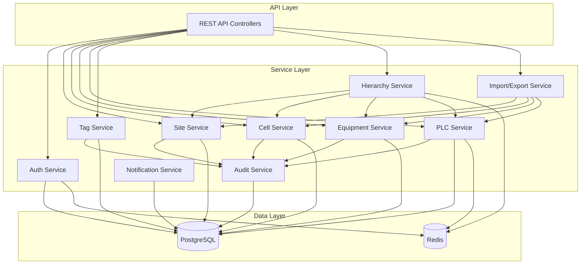

# Components

## Auth Service

**Responsibility:** Handle all authentication and authorization logic including JWT token management, password hashing, role validation, and session management

**Key Interfaces:**
- `login(email: string, password: string): Promise<AuthResponse>`
- `validateToken(token: string): Promise<User>`
- `refreshToken(token: string): Promise<string>`
- `logout(userId: string): Promise<void>`

**Dependencies:** PostgreSQL (users, roles tables), Redis (session storage), bcrypt, jsonwebtoken

**Technology Stack:** TypeScript, Express middleware, JWT tokens with 24-hour expiry, Redis for token blacklisting

## Site Service

**Responsibility:** CRUD operations for sites, validation of site names, cascade handling for site deletion

**Key Interfaces:**
- `createSite(data: SiteInput): Promise<Site>`
- `getSites(filters: SiteFilters): Promise<PaginatedResponse<Site>>`
- `updateSite(id: string, data: SiteUpdate): Promise<Site>`
- `deleteSite(id: string): Promise<void>`

**Dependencies:** PostgreSQL (sites table), Audit Service

**Technology Stack:** TypeScript, TypeORM repositories, Joi validation

## Cell Management Service

**Responsibility:** Manage production cells within sites, enforce site-cell relationships, handle cell-to-equipment cascade operations

**Key Interfaces:**
- `createCell(siteId: string, data: CellInput): Promise<Cell>`
- `getCellsBySite(siteId: string): Promise<Cell[]>`
- `moveCell(cellId: string, newSiteId: string): Promise<Cell>`
- `getCellWithCounts(cellId: string): Promise<CellDetails>`

**Dependencies:** PostgreSQL (cells table), Site Service, Audit Service

**Technology Stack:** TypeScript, TypeORM with relations, transaction support

## Equipment Service

**Responsibility:** Equipment lifecycle management, type validation, equipment-to-PLC relationship management

**Key Interfaces:**
- `createEquipment(cellId: string, data: EquipmentInput): Promise<Equipment>`
- `getEquipmentByCell(cellId: string): Promise<Equipment[]>`
- `moveEquipment(equipmentId: string, newCellId: string): Promise<Equipment>`
- `getEquipmentWithPLCCount(equipmentId: string): Promise<EquipmentDetails>`

**Dependencies:** PostgreSQL (equipment table), Cell Service, Audit Service

**Technology Stack:** TypeScript, TypeORM, enum validation for equipment types

## PLC Service

**Responsibility:** Core PLC management including IP address uniqueness, tag ID validation, firmware tracking, search functionality

**Key Interfaces:**
- `createPLC(equipmentId: string, data: PLCInput): Promise<PLC>`
- `searchPLCs(filters: PLCSearchFilters): Promise<PLCWithHierarchy[]>`
- `updatePLCFirmware(plcId: string, version: string): Promise<PLC>`
- `findByIPAddress(ip: string): Promise<PLC | null>`

**Dependencies:** PostgreSQL (plcs table), Equipment Service, Audit Service, Redis (search cache)

**Technology Stack:** TypeScript, PostgreSQL full-text search, Redis caching for frequent queries

## Tag Service

**Responsibility:** PLC tag management, data type validation, address conflict detection

**Key Interfaces:**
- `createTag(plcId: string, data: TagInput): Promise<Tag>`
- `getTagsByPLC(plcId: string): Promise<Tag[]>`
- `bulkCreateTags(plcId: string, tags: TagInput[]): Promise<Tag[]>`
- `validateTagAddress(plcId: string, address: string): Promise<boolean>`

**Dependencies:** PostgreSQL (tags table), PLC Service, Audit Service

**Technology Stack:** TypeScript, batch operations for performance, enum validation for data types

## Hierarchy Service

**Responsibility:** Complex hierarchy queries, tree generation, breadcrumb creation, move operations across levels

**Key Interfaces:**
- `getFullHierarchy(): Promise<HierarchyNode[]>`
- `getBreadcrumbs(entityType: string, entityId: string): Promise<Breadcrumb[]>`
- `getAncestors(plcId: string): Promise<HierarchyPath>`
- `validateMove(sourceId: string, targetId: string): Promise<boolean>`

**Dependencies:** All entity services, PostgreSQL recursive CTEs

**Technology Stack:** TypeScript, PostgreSQL recursive queries, Redis caching for tree structure

## Import/Export Service

**Responsibility:** Bulk data operations, CSV parsing/generation, hierarchy validation during import, auto-creation of missing entities

**Key Interfaces:**
- `importPLCs(file: Buffer, options: ImportOptions): Promise<ImportResult>`
- `exportPLCs(filters: PLCFilters, format: ExportFormat): Promise<Buffer>`
- `validateCSV(file: Buffer): Promise<ValidationResult>`
- `generateTemplate(): Promise<Buffer>`

**Dependencies:** All entity services, csv-parse, csv-stringify libraries

**Technology Stack:** TypeScript, streaming for large files, transaction support for atomic imports

## Audit Service

**Responsibility:** Comprehensive audit logging, risk assessment, compliance reporting, audit log integrity

**Key Interfaces:**
- `logChange(change: AuditEntry): Promise<void>`
- `getAuditTrail(entityId: string): Promise<AuditLog[]>`
- `generateComplianceReport(dateRange: DateRange): Promise<Report>`
- `calculateRiskLevel(change: AuditEntry): RiskLevel`

**Dependencies:** PostgreSQL (audit_logs table), Auth Service

**Technology Stack:** TypeScript, PostgreSQL triggers, scheduled checksums for integrity

## Notification Service

**Responsibility:** In-app notifications, system alerts, batch notification processing

**Key Interfaces:**
- `createNotification(userId: string, notification: NotificationInput): Promise<void>`
- `getUserNotifications(userId: string): Promise<Notification[]>`
- `markAsRead(notificationId: string): Promise<void>`
- `broadcastSystemAlert(alert: SystemAlert): Promise<void>`

**Dependencies:** PostgreSQL (notifications table), WebSocket for real-time

**Technology Stack:** TypeScript, Socket.io for real-time updates, batch processing

## Component Interaction Diagram

