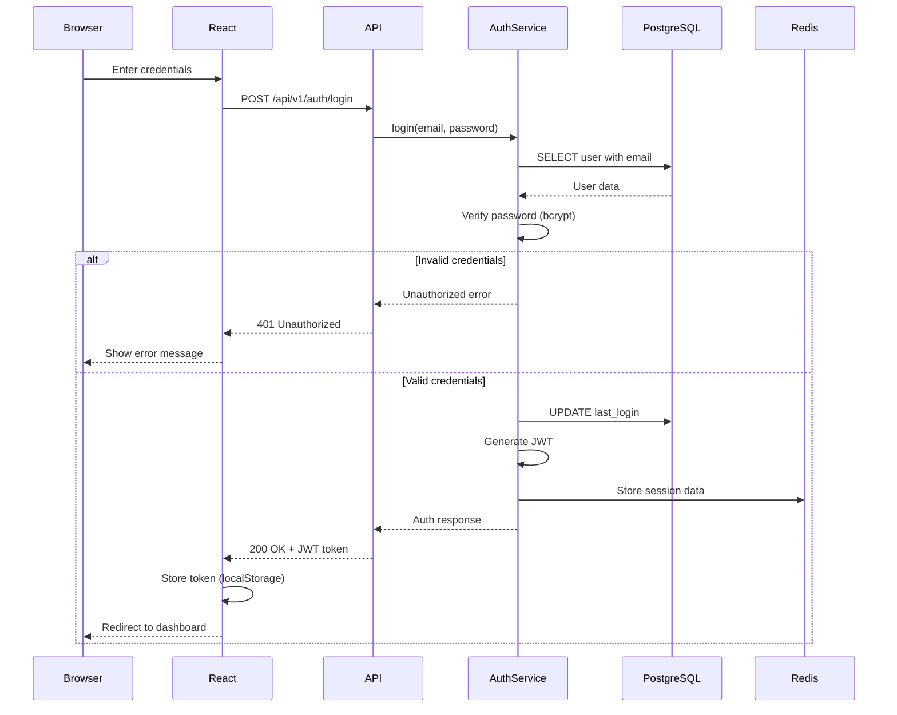
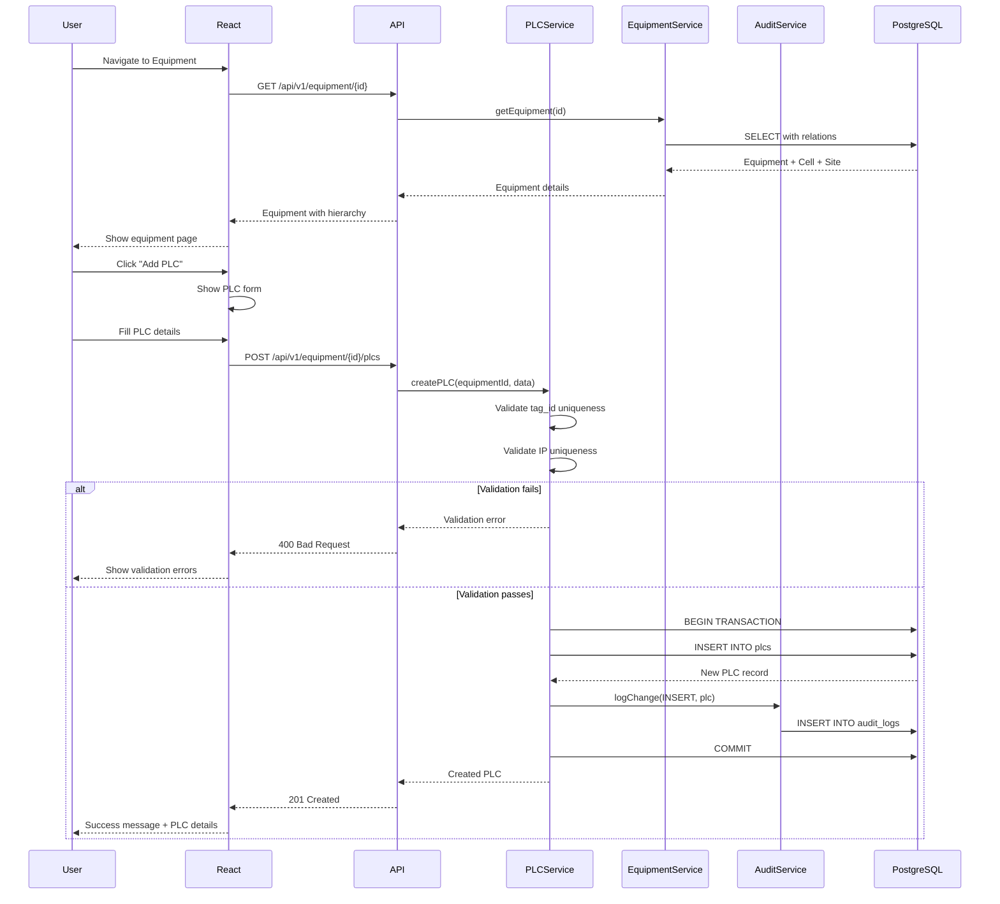
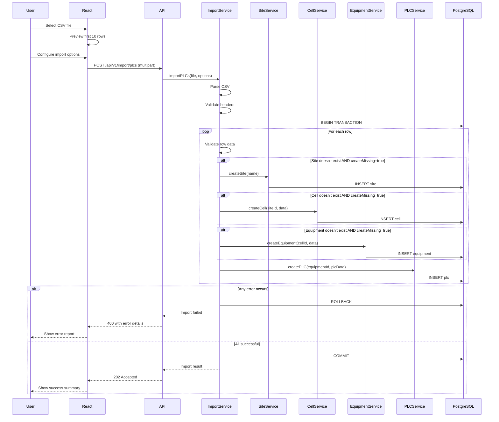
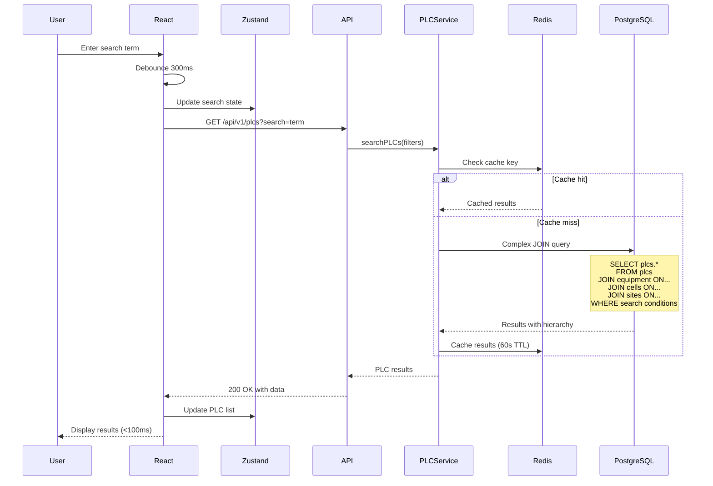
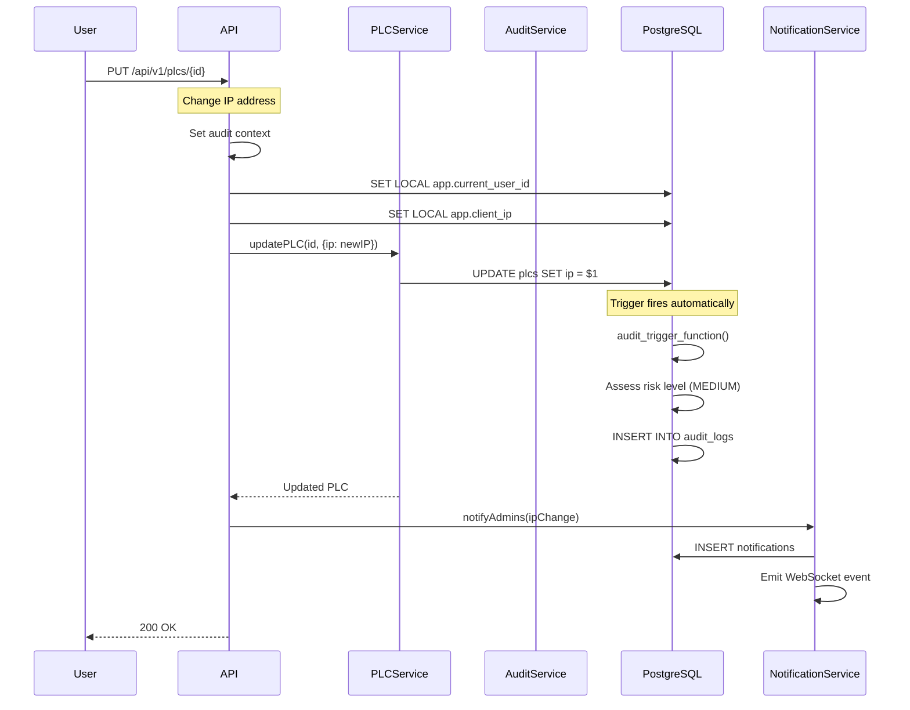
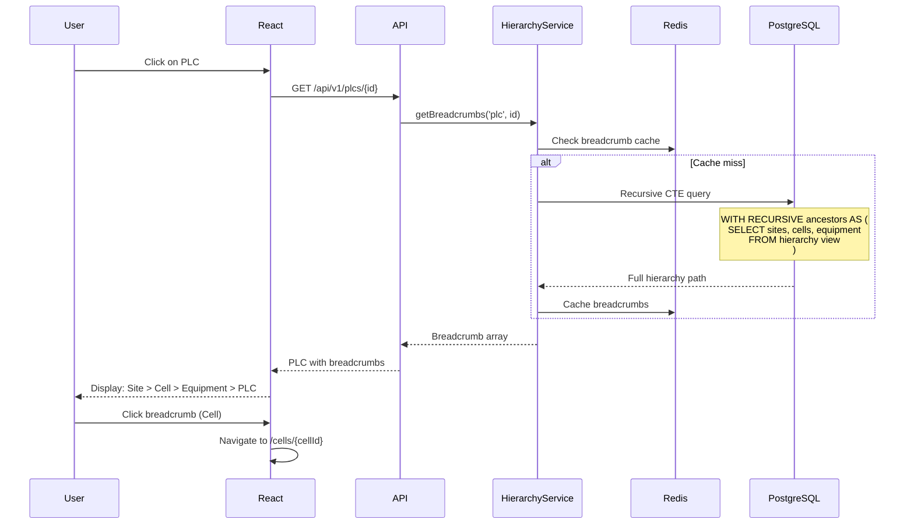
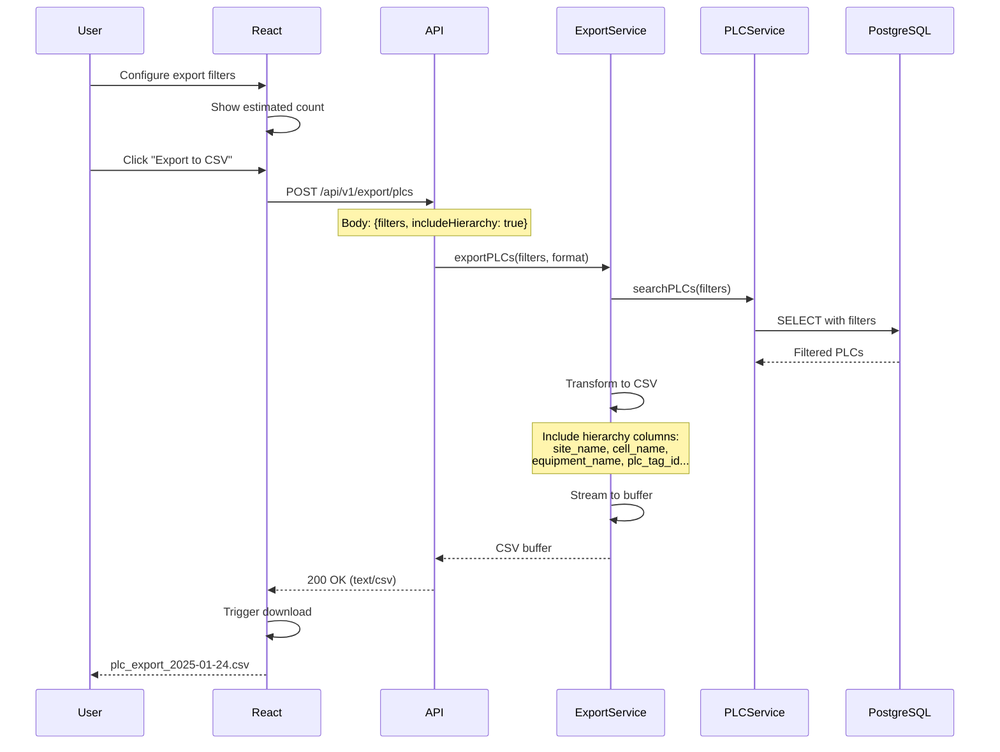

# Core Workflows

## User Authentication Flow

## PLC Creation with Hierarchy Flow

## Bulk PLC Import Flow

## PLC Search and Filter Flow

## Audit Trail for Critical Changes Flow

## Hierarchy Navigation Flow

## Export with Filters Flow

