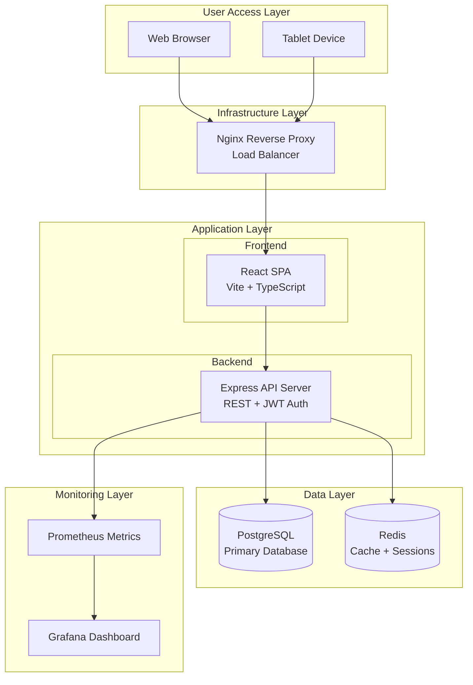

# High Level Architecture

## Technical Summary
The Industrial Inventory Multi-App Framework employs a layered monolithic architecture deployed via Docker Swarm
for on-premise industrial environments. Built with React + TypeScript frontend and Node.js + Express backend, the
system provides RESTful APIs for communication between layers. The architecture leverages PostgreSQL for persistent
storage and Redis for caching/sessions, with all services orchestrated through Docker Compose. This design achieves
the PRD goals of high performance (<100ms queries), ISO compliance through comprehensive audit logging, and provides
a reusable foundation for future industrial applications while maintaining compatibility with air-gapped networks.

## Platform and Infrastructure Choice
**Platform:** On-Premise Docker Swarm
**Key Services:** PostgreSQL 15, Redis 7, Nginx 1.24, Grafana 9.x, Prometheus 2.x
**Deployment Host and Regions:** Single on-premise data center (air-gapped industrial network)

## Repository Structure
**Structure:** Monorepo with clear module boundaries
**Monorepo Tool:** pnpm workspaces (better performance and disk efficiency than npm/yarn)
**Package Organization:**
- `/apps` - Application packages (web, api)
- `/packages` - Shared libraries (ui, shared-types, config)
- `/infrastructure` - Docker configs and deployment scripts

## High Level Architecture Diagram

## Architectural Patterns
- **Layered Architecture:** Clear separation between presentation, business logic, and data layers - *Rationale:* Simplifies development and maintenance for solo developer while enabling future team scaling
- **Component-Based UI:** Reusable React components with TypeScript and Storybook documentation - *Rationale:* Accelerates development of future apps within the framework
- **Repository Pattern:** Abstract data access through TypeORM repositories - *Rationale:* Enables testing and potential future database migrations
- **API Gateway Pattern:** Nginx as single entry point for all requests - *Rationale:* Centralized SSL termination, load balancing, and request routing
- **JWT Authentication:** Stateless auth with Redis session storage - *Rationale:* Scalable authentication that works in distributed environments
- **Audit Trail Pattern:** Comprehensive logging of all data modifications - *Rationale:* ISO compliance requirement with PostgreSQL triggers for reliability
- **Offline-First Design:** Local caching and sync mechanisms - *Rationale:* Critical for air-gapped industrial environments
- **Schema-Per-App Pattern:** Shared core + app-specific schemas - *Rationale:* Enables multi-app framework while maintaining data isolation
