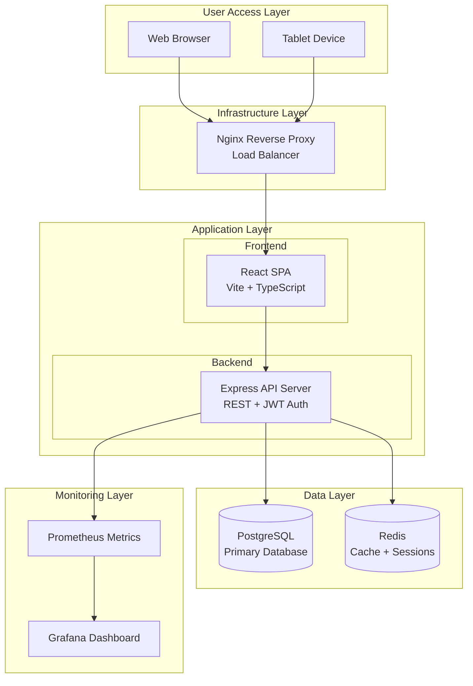

# High Level Architecture

## Architecture Principles

The Industrial Inventory Multi-App Framework is built on the following core principles:

1. **Air-Gap Compatible**: Designed for on-premise, offline industrial networks
2. **Multi-App Foundation**: Shared foundation supporting multiple industrial applications
3. **Industrial-First**: Optimized for industrial environments and requirements
4. **Scalable Performance**: Targets <100ms query response with 10,000+ records
5. **ISO Compliance**: Comprehensive audit trails and security measures
6. **Solo Developer Friendly**: Clear patterns and comprehensive tooling

## Technical Summary

The Industrial Inventory Multi-App Framework employs a layered monolithic architecture deployed via Docker Swarm
for on-premise industrial environments. Built with React + TypeScript frontend and Node.js + Express backend, the
system provides RESTful APIs for communication between layers. The architecture leverages PostgreSQL for persistent
storage and Redis for caching/sessions, with all services orchestrated through Docker Compose. This design achieves
the PRD goals of high performance (<100ms queries), ISO compliance through comprehensive audit logging, and provides
a reusable foundation for future industrial applications while maintaining compatibility with air-gapped networks.

## Platform and Infrastructure Choice

**Platform:** On-Premise Docker Swarm
**Key Services:** PostgreSQL 15, Redis 7, Nginx 1.24, Grafana 9.x, Prometheus 2.x
**Deployment Host and Regions:** Single on-premise data center (air-gapped industrial network)

## Repository Structure

**Structure:** Monorepo with clear module boundaries
**Monorepo Tool:** pnpm workspaces (better performance and disk efficiency than npm/yarn)
**Package Organization:**

- `/apps` - Application packages (web, api)
- `/packages` - Shared libraries (ui, shared-types, config)
- `/infrastructure` - Docker configs and deployment scripts

## High Level Architecture Diagram

## Architectural Patterns

- **Layered Architecture:** Clear separation between presentation, business logic, and data layers - _Rationale:_ Simplifies development and maintenance for solo developer while enabling future team scaling
- **Component-Based UI:** Reusable React components with TypeScript and Storybook documentation - _Rationale:_ Accelerates development of future apps within the framework
- **Repository Pattern:** Abstract data access through TypeORM repositories - _Rationale:_ Enables testing and potential future database migrations
- **API Gateway Pattern:** Nginx as single entry point for all requests - _Rationale:_ Centralized SSL termination, load balancing, and request routing
- **JWT Authentication:** Stateless auth with Redis session storage - _Rationale:_ Scalable authentication that works in distributed environments
- **Audit Trail Pattern:** Comprehensive logging of all data modifications - _Rationale:_ ISO compliance requirement with PostgreSQL triggers for reliability
- **Offline-First Design:** Local caching and sync mechanisms - _Rationale:_ Critical for air-gapped industrial environments
- **Schema-Per-App Pattern:** Shared core + app-specific schemas - _Rationale:_ Enables multi-app framework while maintaining data isolation

## Key Architectural Decisions

### 1. Multi-App Framework Approach

**Decision**: Build a shared foundation that supports multiple industrial applications

**Rationale**:

- **Reusability**: Common infrastructure, authentication, and UI components
- **Consistency**: Shared patterns and technologies across applications
- **Efficiency**: Avoid rebuilding common functionality for each app
- **Maintenance**: Centralized updates and security patches

**Implementation**:

- Shared database schemas for users, roles, audit logs
- Common React component library
- Standardized API patterns and middleware
- Unified Docker infrastructure

### 2. Monorepo with pnpm Workspaces

**Decision**: Use pnpm workspaces for monorepo management

**Rationale**:

- **Performance**: Faster installs and better disk efficiency
- **Dependency Management**: Shared dependencies across packages
- **Type Safety**: Cross-package TypeScript references
- **Build Optimization**: Incremental builds and caching

### 3. PostgreSQL as Primary Database

**Decision**: PostgreSQL for primary data storage

**Rationale**:

- **Industrial Compliance**: ACID transactions and data integrity
- **Performance**: Excellent query performance for complex queries
- **Features**: JSON support, full-text search, GIN indexes for arrays
- **Reliability**: Proven in industrial environments
- **Air-Gap Compatible**: No external dependencies

### 4. TypeScript-First Development

**Decision**: TypeScript for both frontend and backend

**Rationale**:

- **Type Safety**: Catch errors at compile time
- **Code Quality**: Better refactoring and IDE support
- **Documentation**: Types serve as living documentation
- **Shared Types**: Common interfaces between frontend/backend

### 5. Docker-Based Infrastructure

**Decision**: Docker Compose for development, Docker Swarm for production

**Rationale**:

- **Environment Consistency**: Same containers in dev/prod
- **Air-Gap Deployment**: Self-contained application stack
- **Scalability**: Easy horizontal scaling with Swarm
- **Industrial Compatibility**: Reliable deployment in industrial networks
