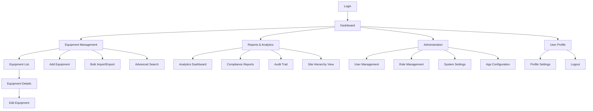
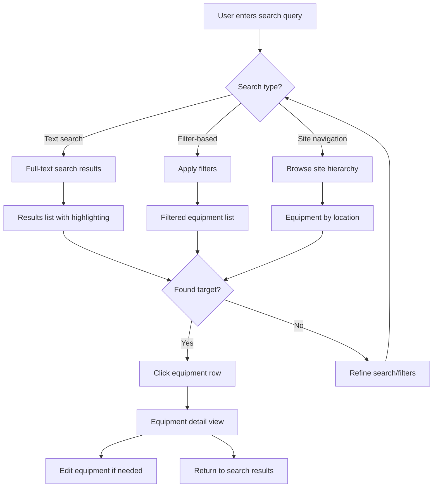

# Industrial Inventory Multi-App Framework UI/UX Specification

This document defines the user experience goals, information architecture, user flows, and visual design
specifications for Industrial Inventory Multi-App Framework's user interface. It serves as the foundation for
visual design and frontend development, ensuring a cohesive and user-centered experience.

## Introduction

### Overall UX Goals & Principles

#### Target User Personas

**Field Engineer:** Technical professional who needs quick equipment lookup during plant visits, often using
tablets in industrial environments with varying lighting conditions and while wearing safety equipment.

**Controls Engineer:** Power user managing large equipment datasets, requiring advanced filtering and bulk
operations for efficient inventory management across multiple sites and production cells.

**Plant Manager:** Oversight role needing dashboards, reports, and audit trails for compliance, with focus
on equipment distribution, status monitoring, and operational insights.

#### Usability Goals

- **Ease of learning:** New engineers can complete core equipment tasks within 15 minutes
- **Efficiency of use:** Frequent tasks completable in <3 clicks with <100ms response times
- **Industrial durability:** Interface works reliably in harsh lighting and with work gloves
- **Error prevention:** Clear validation and confirmation for critical operations (delete, bulk changes)
- **Memorability:** Infrequent users can return without relearning core workflows

#### Design Principles

1. **Industrial Efficiency Over Aesthetics** - Function and speed trump visual flair, prioritizing data clarity and task completion
2. **Information Density** - Show maximum relevant data without overwhelming, optimized for technical users who need comprehensive information
3. **Touch-Friendly Precision** - Works reliably on tablets with industrial gloves, maintaining precision for detailed data entry
4. **Consistent Mental Models** - Use familiar patterns across all framework apps to reduce learning curve for future applications
5. **Fail-Safe Operations** - Clear confirmations for destructive actions with comprehensive audit trails for compliance

### Change Log

| Date       | Version | Description                          | Author            |
| ---------- | ------- | ------------------------------------ | ----------------- |
| 2025-07-24 | 1.0     | Initial UI/UX specification creation | Sally (UX Expert) |

## Information Architecture (IA)

### Site Map / Screen Inventory

### Navigation Structure

**Primary Navigation:** Top-level app areas (Dashboard, Equipment, Reports, Admin) - persistent header
optimized for desktop efficiency and tablet accessibility

**Secondary Navigation:** Context-sensitive sidebar for sub-functions within each area, collapsible on
tablet devices for space efficiency

**Breadcrumb Strategy:** Essential for multi-level equipment hierarchy (Site > Cell Type > Cell ID >
Equipment), providing clear location context and quick navigation back to parent levels

## User Flows

### Equipment Search & Discovery Flow

**User Goal:** Process engineer needs to quickly locate specific equipment during plant troubleshooting

**Entry Points:**

- Dashboard search bar
- Equipment list page
- Direct navigation from site hierarchy

**Success Criteria:**

- Find target equipment in <30 seconds
- Access equipment details immediately
- Clear path to edit if needed

#### Flow Diagram

#### Edge Cases & Error Handling

- No search results found → Suggest similar terms, check spelling
- Network timeout in air-gapped environment → Show cached results, retry option
- Equipment found but access restricted → Clear permission message
- Search query too broad (>1000 results) → Prompt for more specific criteria

**Notes:** This flow prioritizes speed over comprehensiveness - engineers in the field need immediate results. The multi-path approach accommodates different user preferences and contexts.

## Wireframes & Mockups

### Primary Design Files

**Primary Design Files:** React Storybook + Component Library

- Build components directly in React/TypeScript for living design system
- Use Storybook for component documentation and testing
- Material-UI base with industrial theme customization
- Live, interactive "designs" that are actually functional code

### Key Screen Layouts

#### Equipment List/Search (Dual-Device Design)

**Purpose:** Central hub optimized for both desktop efficiency and tablet mobility

**Key Elements:**

- **Desktop:** Full data grid with 8-10 columns, persistent filter sidebar, keyboard navigation support
- **Tablet:** Card-based layout with 4-5 key fields, collapsible filter drawer, touch-optimized interactions
- **Both:** Prominent search bar, bulk action toolbar, quick add button, consistent search logic

**Interaction Notes:**

- **Desktop:** Mouse hover states, right-click context menus, keyboard shortcuts, multi-selection
- **Tablet:** Touch-friendly 44px+ targets, swipe gestures for actions, long-press context menus
- **Both:** Virtual scrolling for 10,000+ records, debounced search, GSAP animations for state transitions

**Design File Reference:** React components in Storybook - DataGrid, SearchFilters, BulkActions

#### Equipment Detail/Edit Form (Responsive Approach)

**Purpose:** Comprehensive editing optimized for each device context

**Key Elements:**

- **Desktop:** Two-column form layout, inline validation, tabbed sections for complex data
- **Tablet:** Single-column layout, larger touch targets, accordion sections for organization
- **Both:** Auto-complete dropdowns, tag chips, visual validation feedback, auto-save with confirmation

**Interaction Notes:**

- **Desktop:** Tab navigation between fields, Enter to save, Esc to cancel, keyboard shortcuts
- **Tablet:** Virtual keyboard optimization, touch-friendly date pickers, gesture support
- **Both:** Auto-save with visual confirmation, unsaved changes warnings, consistent validation

**Design File Reference:** React components - EquipmentForm, ValidationFeedback, TagInput

#### Dashboard Overview (Context-Aware)

**Purpose:** Information priority adjusted for device usage context

**Key Elements:**

- **Desktop:** Multi-column layout with detailed charts and data tables, concurrent information display
- **Tablet:** Stacked cards prioritizing actionable information, simplified charts, swipe navigation
- **Both:** Status indicators, quick actions, search widget, real-time updates, offline indicators

**Interaction Notes:**

- **Desktop:** Detailed hover tooltips, multiple simultaneous chart interactions, keyboard navigation
- **Tablet:** Touch-optimized charts, swipe navigation between sections, pull-to-refresh
- **Both:** GSAP-animated data transitions, automatic updates every 5 minutes, responsive chart rendering

**Design File Reference:** React components - DashboardGrid, EquipmentChart, StatusIndicators

## Component Library / Design System

### Design System Approach

**React Component Library with Material-UI Industrial Theme**

- Base: Material-UI components customized for industrial contexts
- Enhancement: GSAP animations for professional micro-interactions
- Framework: Storybook for component development and documentation
- Distribution: NPM package for easy sharing across framework apps

### Core Components

#### DataGrid (Industrial Data Table)

**Purpose:** High-performance equipment listing with industrial-grade functionality

**Variants:**

- Standard Grid (desktop): Full feature set with 8+ columns, advanced filtering
- Compact Grid (tablet): Condensed view with key fields only, touch optimization
- Card View (mobile): Stacked cards for touch interaction, essential information

**States:**

- Loading (skeleton animation with GSAP shimmer effect)
- Empty (helpful guidance state with clear next actions)
- Error (clear recovery options with retry mechanisms)
- Selection (bulk operation mode with multi-select capabilities)

**Usage Guidelines:**

- Use for any tabular equipment data >50 records
- Always include virtual scrolling for performance with large datasets
- Provide keyboard navigation for power users and accessibility

#### EquipmentForm (Industrial Form System)

**Purpose:** Consistent form experience across all equipment data entry

**Variants:**

- Create Mode: Empty form with smart defaults and field suggestions
- Edit Mode: Pre-populated with change tracking and audit logging
- View Mode: Read-only with clear edit trigger and permission awareness

**States:**

- Pristine (no changes made, clean initial state)
- Dirty (unsaved changes with auto-save indicator and visual feedback)
- Validating (real-time validation feedback with GSAP animations)
- Saving (progress indication with smooth transitions)
- Error (field-level error messaging with clear recovery guidance)

**Usage Guidelines:**

- Always include auto-save with visual confirmation every 30 seconds
- Use touch-friendly targets (44px minimum) for industrial tablet usage
- Provide clear required field indicators and validation feedback

#### StatusCard (Dashboard Widget)

**Purpose:** Consistent information display for dashboard and summary views

**Variants:**

- Metric Card: Single number with trend indicator and historical context
- Chart Card: Embedded visualization with touch/click interactions
- Action Card: Quick actions with prominent call-to-action buttons

**States:**

- Loading (animated placeholder with professional skeleton design)
- Loaded (data with GSAP entrance animation and smooth transitions)
- Error (retry mechanism with clear error messaging)
- Interactive (hover/touch feedback with subtle GSAP effects)

**Usage Guidelines:**

- Use GSAP for smooth data transitions and professional feel
- Keep information hierarchy clear with proper typography scale
- Ensure touch targets meet industrial glove requirements (44px+)

#### NavigationSidebar (Framework Navigation)

**Purpose:** Consistent navigation across all framework applications

**Variants:**

- Expanded: Full labels and icons for desktop efficiency
- Collapsed: Icons only for space efficiency with tooltips
- Mobile: Drawer overlay for small screens with touch optimization

**States:**

- Active Section (visual emphasis on current area with clear highlighting)
- Hover/Focus (GSAP micro-interactions with subtle feedback)
- Loading (navigation state feedback during route transitions)

**Usage Guidelines:**

- Maintain consistency across all framework apps for user familiarity
- Use breadcrumbs for deep navigation and clear location context
- Provide full keyboard navigation support for accessibility

## Branding & Style Guide

### Visual Identity

**Brand Guidelines:** Technical Brand System focused on professional credibility, high contrast for industrial environments, and consistent visual language across framework applications.

### Color Palette

#### Light Mode (Primary)

| Color Type     | Hex Code  | Usage                                            |
| -------------- | --------- | ------------------------------------------------ |
| Primary        | `#1976d2` | Primary actions, links, active states            |
| Primary Dark   | `#115293` | Primary hover states, emphasis                   |
| Secondary      | `#424242` | Secondary actions, neutral elements              |
| Accent         | `#ff9800` | Warnings, important notices, highlights          |
| Success        | `#4caf50` | Confirmations, success states, online indicators |
| Warning        | `#ff9800` | Cautions, important notices, pending states      |
| Error          | `#f44336` | Errors, destructive actions, offline indicators  |
| Background     | `#fafafa` | Main background                                  |
| Surface        | `#ffffff` | Cards, modals, elevated elements                 |
| Text Primary   | `#212121` | Main text content                                |
| Text Secondary | `#757575` | Supporting text, labels                          |

#### Dark Mode (Industrial Night Mode)

| Color Type     | Hex Code  | Usage                                                        |
| -------------- | --------- | ------------------------------------------------------------ |
| Primary        | `#90caf9` | Primary actions, links, active states (lighter for contrast) |
| Primary Dark   | `#42a5f5` | Primary hover states, emphasis                               |
| Secondary      | `#bdbdbd` | Secondary actions, neutral elements                          |
| Accent         | `#ffb74d` | Warnings, important notices, highlights                      |
| Success        | `#81c784` | Confirmations, success states, online indicators             |
| Warning        | `#ffb74d` | Cautions, important notices, pending states                  |
| Error          | `#e57373` | Errors, destructive actions, offline indicators              |
| Background     | `#121212` | Main background (Material Design dark)                       |
| Surface        | `#1e1e1e` | Cards, modals, elevated elements                             |
| Text Primary   | `#ffffff` | Main text content                                            |
| Text Secondary | `#b3b3b3` | Supporting text, labels                                      |

### Typography

#### Font Families

- **Primary:** 'Roboto', sans-serif (Material-UI default, excellent readability)
- **Secondary:** 'Roboto Condensed', sans-serif (for data-dense areas, space efficiency)
- **Monospace:** 'Roboto Mono', monospace (for IP addresses, technical codes, data values)

#### Type Scale

| Element | Size            | Weight        | Line Height |
| ------- | --------------- | ------------- | ----------- |
| H1      | 2.125rem (34px) | 300 (Light)   | 1.235       |
| H2      | 1.5rem (24px)   | 400 (Regular) | 1.334       |
| H3      | 1.25rem (20px)  | 400 (Regular) | 1.6         |
| Body    | 1rem (16px)     | 400 (Regular) | 1.5         |
| Small   | 0.875rem (14px) | 400 (Regular) | 1.43        |

### Iconography

**Icon Library:** Material-UI Icons + Custom Industrial Supplements

- Base: Material-UI icon set for consistency and completeness
- Custom: Industrial-specific icons (PLC types, sensors, controllers)
- Style: Outlined style for better visibility at small sizes
- Size: 24px standard, 20px compact, 16px inline

**Usage Guidelines:**

- Always pair icons with text labels in navigation
- Use consistent icon metaphors across framework apps
- Ensure 3:1 color contrast ratio for icon visibility
- Custom industrial icons should match Material Design style

### Spacing & Layout

**Grid System:** Material-UI 12-column responsive grid

- Breakpoints: xs(0px), sm(600px), md(960px), lg(1280px), xl(1920px)
- Container max-width: 1200px for optimal data table viewing
- Gutters: 16px mobile, 24px desktop

**Spacing Scale:** 8px base unit system

- xs: 4px, sm: 8px, md: 16px, lg: 24px, xl: 32px, xxl: 48px
- Consistent spacing creates visual rhythm
- Based on 8px grid for pixel-perfect alignment
- Supports Material-UI's spacing system

## Accessibility Requirements

### Compliance Target

**Standard:** WCAG 2.1 AA compliance with industrial environment enhancements

### Key Requirements

**Visual:**

- Color contrast ratios: 4.5:1 minimum for normal text, 3:1 for large text and UI components (both light and dark modes tested)
- Focus indicators: High-contrast 3px outline with 2px offset, visible in both themes, GSAP-animated for smooth transitions
- Text sizing: Minimum 16px base size, scalable to 200% without horizontal scrolling, readable with safety glasses

**Interaction:**

- Keyboard navigation: Full application navigable via keyboard only, logical tab order, skip links for data tables, custom key shortcuts for power users
- Screen reader support: Proper ARIA labels, live regions for status updates, structured headings, descriptive link text, table headers properly associated
- Touch targets: Minimum 44px for all interactive elements, adequate spacing between targets, works reliably with work gloves

**Content:**

- Alternative text: Descriptive alt text for all equipment diagrams and status icons, empty alt for decorative images
- Heading structure: Logical H1-H6 hierarchy, each page starts with H1, no skipped heading levels
- Form labels: Every form field has associated label, required fields clearly marked, error messages descriptive and linked to fields

### Testing Strategy

**Multi-Method Accessibility Testing:**

1. **Automated Testing:** axe-core integration in Storybook, Lighthouse accessibility audits in CI/CD pipeline, color contrast analyzers for both themes

2. **Manual Testing:** Keyboard-only navigation, screen reader testing (NVDA, JAWS, VoiceOver), high contrast mode compatibility, zoom testing up to 200%

3. **Industrial Context Testing:** Interface testing while wearing safety glasses, touch interaction with work gloves, visibility under industrial lighting, noise environment validation

4. **User Testing:** Testing with engineers who use assistive technologies, validation with users who have visual/motor impairments

## Responsiveness Strategy

### Breakpoints

| Breakpoint | Min Width | Max Width | Target Devices                                        |
| ---------- | --------- | --------- | ----------------------------------------------------- |
| Mobile     | 320px     | 599px     | Phones (emergency access only)                        |
| Tablet     | 600px     | 959px     | Industrial tablets, rugged tablets, field devices     |
| Desktop    | 960px     | 1279px    | Control room workstations, office desktops            |
| Wide       | 1280px    | -         | Large monitors, multi-monitor setups, control centers |

### Adaptation Patterns

**Layout Changes:**

- **Desktop/Wide:** Multi-column layouts with sidebar navigation, full data tables, multiple concurrent views
- **Tablet:** Single-column primary content with collapsible navigation, card-based data display, touch-optimized spacing
- **Mobile:** Stacked navigation, essential information only, progressive disclosure for complex data

**Navigation Changes:**

- **Desktop/Wide:** Persistent sidebar with full labels, breadcrumb navigation, tabbed interfaces
- **Tablet:** Collapsible drawer navigation, prominent search, swipe gestures for quick actions
- **Mobile:** Bottom navigation or hamburger menu, search-first approach, simplified hierarchy

**Content Priority:**

- **Desktop/Wide:** High information density, multiple data columns, detailed status information, advanced filtering always visible
- **Tablet:** Key information prioritized, secondary details on tap/expand, simplified filtering with drawer panels
- **Mobile:** Essential data only, drill-down for details, single-action focus

**Interaction Changes:**

- **Desktop/Wide:** Hover states, right-click context menus, keyboard shortcuts, multi-selection with Shift/Ctrl
- **Tablet:** Touch-first interactions, long-press context menus, swipe gestures, drag-and-drop for reordering
- **Mobile:** Large touch targets, tap-to-reveal actions, pull-to-refresh, simplified gestures

## Animation & Micro-interactions

### Motion Principles

**Industrial Motion Design Philosophy:**

1. **Functional First:** Every animation serves a clear purpose (feedback, transition, or guidance)
2. **Subtle & Professional:** Enhance usability without drawing attention to the animation itself
3. **Performance Conscious:** Smooth 60fps animations that don't impact data processing
4. **Consistent Timing:** Standardized durations and easing for predictable user experience
5. **Accessible Motion:** Respect `prefers-reduced-motion` for users sensitive to animation

### Key Animations

**Core Equipment Management Animations:**

- **Equipment Row Hover:** Subtle background color transition with slight elevation (Duration: 150ms, Easing: power2.out)
- **Form Field Focus:** Border color change with gentle glow effect (Duration: 200ms, Easing: power2.out)
- **Auto-save Confirmation:** Success checkmark with gentle scale animation (Duration: 400ms, Easing: back.out)
- **Data Loading:** Professional skeleton animation with shimmer effect (Duration: 1.5s loop, Easing: linear)
- **Filter Panel Slide:** Smooth slide-in/out with backdrop fade (Duration: 300ms, Easing: power2.inOut)
- **Status Indicator Pulse:** Subtle breathing animation for online/offline states (Duration: 2s loop, Easing: sine.inOut)
- **Search Results Appearance:** Staggered fade-in of results with slight upward motion (Duration: 250ms, Easing: power2.out)
- **Theme Toggle:** Smooth color transitions across entire interface (Duration: 400ms, Easing: power2.inOut)
- **Bulk Selection:** Checkbox states with satisfying check animation (Duration: 200ms, Easing: back.out)
- **Error State:** Gentle shake animation for invalid input feedback (Duration: 300ms, Easing: elastic.out)
- **Modal Open/Close:** Scale and fade transition with backdrop blur (Duration: 300ms, Easing: power2.out)
- **Chart Data Updates:** Smooth interpolation between data states (Duration: 500ms, Easing: power2.inOut)

## Performance Considerations

### Performance Goals

- **Page Load:** Initial application load <2 seconds, subsequent navigation <500ms
- **Interaction Response:** User interactions (clicks, typing) respond within 100ms
- **Animation FPS:** Maintain 60fps for all GSAP animations, even with large datasets
- **Data Operations:** Equipment search/filtering <100ms for datasets up to 10,000 records
- **Memory Usage:** Total application memory footprint <2GB as specified in requirements

### Design Strategies

**Performance-First Design Decisions:**

1. **Virtual Scrolling Architecture:** Only render visible rows + buffer for large datasets, GSAP animations only on visible elements

2. **Progressive Data Loading:** Essential equipment data on initial load, detailed information on-demand, background preloading of likely-needed data

3. **Intelligent Caching Strategy:** Component-level caching with React.memo, API response caching, lazy loading for images, search result caching

4. **Optimized Animation Performance:** GPU acceleration with force3D, batch DOM reads/writes, cleanup of animations and event listeners

5. **Bundle Optimization:** Route-based code splitting, tree shaking unused components, dynamic imports for GSAP plugins, asset optimization

6. **Memory Management:** Proper cleanup of GSAP animations, efficient data structures, minimal object creation in render loops, optimized image disposal

## Next Steps

### Immediate Actions

1. **Stakeholder Review & Validation** - Present specification to engineering stakeholders, validate
   with actual process engineers, confirm technical approach alignment

2. **Component Library Foundation Setup** - Initialize React project with Vite/TypeScript/Material-UI,
   set up Storybook, configure GSAP integration, implement industrial theme system

3. **Priority Component Development** - Start with DataGrid (equipment listing), build EquipmentForm
   (CRUD functionality), create AppLayout/Navigation (framework foundation), develop StatusCard (dashboard
   functionality)

4. **Performance Testing Infrastructure** - Set up testing with 10,000+ records, implement virtual
   scrolling validation, configure accessibility testing automation, establish animation performance
   monitoring

5. **Design System Documentation** - Document component usage in Storybook, create industrial brand
   guidelines, establish development workflow documentation, plan component library distribution

### Design Handoff Checklist

- [x] All user flows documented
- [x] Component inventory complete
- [x] Accessibility requirements defined
- [x] Responsive strategy clear
- [x] Brand guidelines incorporated
- [x] Performance goals established

---

**This UI/UX specification provides a comprehensive foundation for creating an industrial-grade user
interface that meets both functional requirements and user experience needs of the equipment inventory
framework. The React+GSAP approach combined with the industrial design system will create a professional,
efficient, and scalable user interface for the multi-app framework.**
