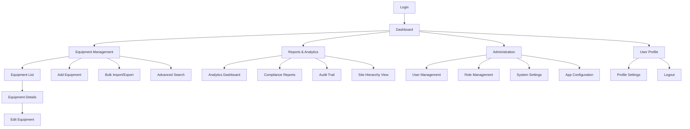

# Information Architecture (IA)

## Site Map / Screen Inventory

## Navigation Structure

**Primary Navigation:** Top-level app areas (Dashboard, Equipment, Reports, Admin) - persistent header
optimized for desktop efficiency and tablet accessibility

**Secondary Navigation:** Context-sensitive sidebar for sub-functions within each area, collapsible on
tablet devices for space efficiency

**Breadcrumb Strategy:** Essential for multi-level equipment hierarchy (Site > Cell Type > Cell ID >
Equipment), providing clear location context and quick navigation back to parent levels
