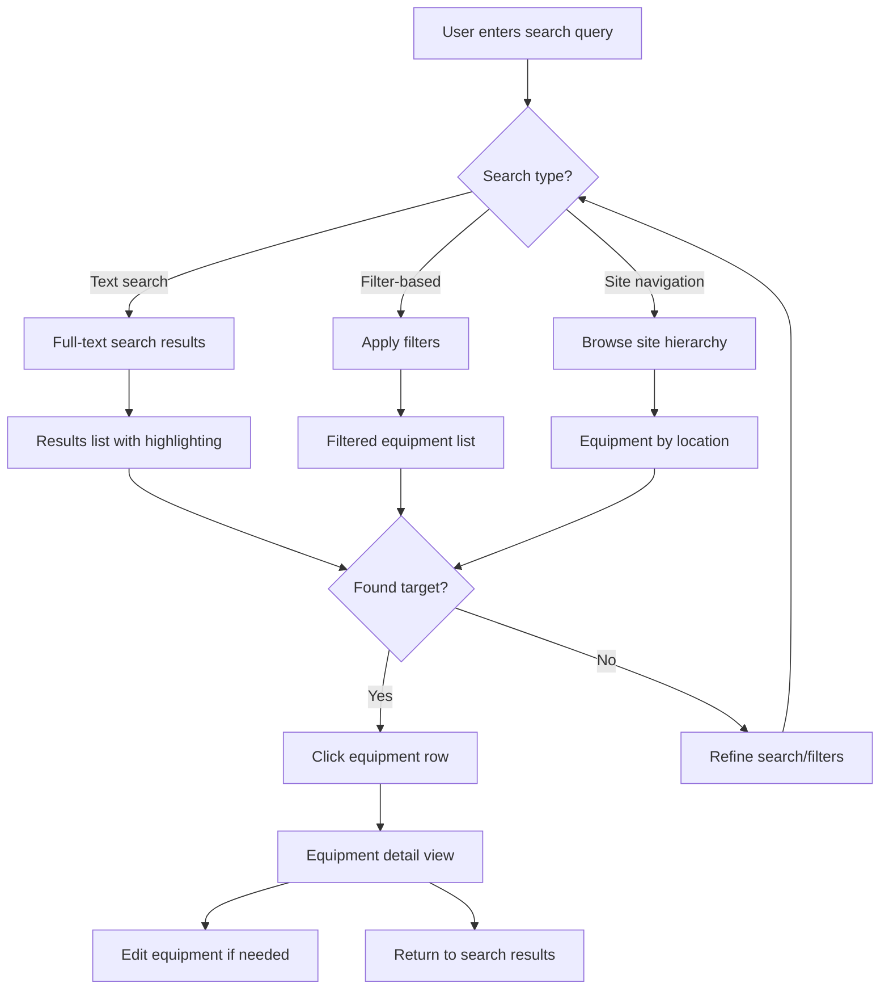

# User Flows

## Equipment Search & Discovery Flow

**User Goal:** Process engineer needs to quickly locate specific equipment during plant troubleshooting

**Entry Points:**
- Dashboard search bar
- Equipment list page
- Direct navigation from site hierarchy

**Success Criteria:**
- Find target equipment in <30 seconds
- Access equipment details immediately
- Clear path to edit if needed

### Flow Diagram

### Edge Cases & Error Handling:
- No search results found → Suggest similar terms, check spelling
- Network timeout in air-gapped environment → Show cached results, retry option
- Equipment found but access restricted → Clear permission message
- Search query too broad (>1000 results) → Prompt for more specific criteria

**Notes:** This flow prioritizes speed over comprehensiveness - engineers in the field need immediate results. The multi-path approach accommodates different user preferences and contexts.
